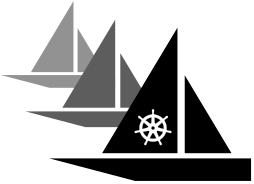

# Armada

Armada is a multi-[Kubernetes](https://kubernetes.io/docs/concepts/overview/) cluster batch job scheduler.

Armada is designed to address the following issues:

1. A single Kubernetes cluster can not be scaled indefinitely, and managing very large Kubernetes clusters is [challenging](https://openai.com/blog/scaling-kubernetes-to-7500-nodes/). Hence, Armada is a multi-cluster scheduler built on top of several Kubernetes clusters.
2. Acheiving very high throughput using the in-cluster storage backend, etcd, is [challenging](https://etcd.io/docs/v3.5/op-guide/performance/). Hence, queueing and scheduling is performed partly out-of-cluster using a specialized storage layer.

Armada is designed primarily for machine learning, AI, and data analytics workloads, and to:

- Manage compute clusters composed of tens of thousands of nodes in total.
- Schedule a thousand or more pods per second, on average.
- Enqueue tens of thousands of jobs over a few seconds.
- Divide resources fairly between users.
- Provide visibility for users and admins.
- Ensure near-constant uptime.

Armada is a [CNCF](https://www.cncf.io/) Sandbox project used in production at [G-Research](https://www.gresearch.co.uk/).

For an overview of Armada, see these videos:

- [Armada - high-throughput batch scheduling](https://www.youtube.com/watch?v=FT8pXYciD9A)
- [Building Armada - Running Batch Jobs at Massive Scale on Kubernetes](https://www.youtube.com/watch?v=B3WPxw3OUl4)

Armada adheres to the CNCF [Code of Conduct](https://github.com/cncf/foundation/blob/master/code-of-conduct.md).

## Documentation

For an overview of the architecture and design of Armada, and instructions for submitting jobs, see:

- [System overview](./docs/design.md)
- [User guide](./docs/user.md)
- [Quickstart](./docs/quickstart/index.md)

To set up Armada for local development, see:

- [Development guide](./docs/development_guide.md)

For API reference, see:
- [API Documentation](./docs/api.md)

We expect readers of the documentation to have a basic understanding of Docker and Kubernetes; see, e.g., the following links:

- [Docker overiew](https://docs.docker.com/get-started/overview/)
- [Kubernetes overview](https://kubernetes.io/docs/concepts/overview/)

## Discussion

Get engage with us on [Armada slack](https://cloud-native.slack.com/?redir=%2Farchives%2FC03T9CBCEMC)
