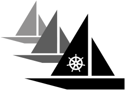

<div align="center">
  

  <h3>One API. Any number of clusters. Millions of jobs.</h3>
  <p>The open-source batch job meta-scheduler that makes Kubernetes work at scale.</p>

  <p>
    <a href="https://circleci.com/gh/armadaproject/armada"></a>
    <a href="https://goreportcard.com/report/github.com/armadaproject/armada"></a>
    <a href="https://artifacthub.io/packages/helm/gresearch/armada" title="Go to Artifact Hub"></a>
    <a href="https://insights.linuxfoundation.org/project/armada" title="Click to view project insights and health checks"></a>
    <a href="https://www.bestpractices.dev/projects/11485"></a>
  </p>

  <p>
    <a href="https://armadaproject.io">Website</a> ·
    <a href="https://armadaproject.io/quickstart">Quickstart</a> ·
    <a href="https://armadaproject.io/docs">Documentation</a> ·
    <a href="https://cloud-native.slack.com/archives/C03T9CBCEMC">Slack</a>
  </p>
</div>

---

## What is Armada?

Kubernetes was built for services. Armada was built for batch.

When your job volume exceeds what a single cluster can handle, you need a control plane that sits above your fleet — routing jobs intelligently, fairly, and at scale. Armada is that layer.

**Armada solves the problems Kubernetes wasn't designed to handle:**

- **No job queue** — Kubernetes has no concept of ordering. Jobs compete for resources with no fairness guarantees. Armada adds a proper queue with priority, fair-share, and rate limiting.
- **No multi-cluster coordination** — Each Kubernetes cluster is an island. Armada routes jobs across as many clusters as you need from a single API.
- **No gang scheduling** — Distributed jobs that need all workers to start simultaneously (MPI, PyTorch, Spark) have no atomic startup guarantee in vanilla Kubernetes. Armada either starts the whole group or holds it.
- **No fairness across teams** — One team can starve everyone else. Armada enforces fair-share scheduling so heavy users don't permanently dominate shared infrastructure.

Armada is used in production at [G-Research](https://www.gresearch.co.uk/) since 2020, processing **millions of batch jobs per day** across tens of thousands of nodes.

---

## Features

| Feature | Description |
|---|---|
| 🌐 **Multi-cluster scheduling** | One API across unlimited Kubernetes clusters |
| ⚖️ **Fair-share queuing** | Dominant resource fairness across teams and queues |
| 🔗 **Gang scheduling** | Atomic startup for distributed workloads |
| ⚡ **Preemption** | Urgent jobs bump lower-priority work automatically |
| 📊 **Prometheus metrics** | Full observability into queue health and cluster utilisation |
| 🔭 **Lookout UI** | Web interface for monitoring jobs, queues, and clusters |
| 🔒 **Enterprise-ready** | Secure, highly available, OIDC authentication support |

---

## Getting started

The fastest way to get Armada running locally is with the [Armada Operator](https://github.com/armadaproject/armada-operator):

```bash
git clone https://github.com/armadaproject/armada-operator.git
cd armada-operator
make kind-all
```

→ **[Full quickstart guide](https://armadaproject.io/quickstart)** — get up and running in under 15 minutes.

### armadactl

Armada's CLI for interacting with the system:

```bash
# download via script
scripts/get-armadactl.sh

# or grab the binary from the releases page
https://github.com/armadaproject/armada/releases/latest
```

---

## Local development

Armada runs locally via [Goreman](https://github.com/mattn/goreman) — dependencies (Redis, Postgres, Pulsar) run in containers, Armada components run as host processes built from source. Iteration is fast and debuggers attach directly.

```bash
mage kind                  # one-time: create local Kubernetes cluster
export KUBECONFIG=.kube/external/config

mage dev:up                # default — no auth
mage dev:up auth           # with OIDC via Keycloak
mage dev:up fake-executor  # no Kubernetes cluster needed
mage dev:down              # stop dependency containers
```

→ **[Full local development guide](https://armadaproject.io/docs/developer-guide)** — profiles, procfiles, service ports, authentication, and debugging.

---

## Use cases

Armada is used wherever batch jobs are too large, too many, or too complex for a single Kubernetes cluster:

- **Quantitative finance & HPC** — millions of short-lived simulations per day with fair-share across research teams
- **ML and AI training** — distributed GPU training with gang scheduling across clusters  
- **Platform engineering** — multi-tenant batch infrastructure with a single API surface
- **SLURM migration** — familiar scheduling semantics (queues, priorities, preemption) on Kubernetes-native infrastructure
- **CI/CD at scale** — priority control so critical merges always run first

---

## In production

Armada has been running in production at [G-Research](https://www.gresearch.co.uk/) since 2020.

**Running Armada in production?** Open a PR to add yourself to [ADOPTERS.md](./ADOPTERS.md) 🙌

---

## Community

Everyone is welcome — come and say hi! 👋

- 💬 **Slack** — [#armada on CNCF Slack](https://cloud-native.slack.com/archives/C03T9CBCEMC) — fastest way to get help and talk to maintainers
- 💡 **GitHub Discussions** — [longer-form questions and ideas](https://github.com/armadaproject/armada/discussions)
- 🐛 **GitHub Issues** — [bug reports and feature requests](https://github.com/armadaproject/armada/issues)
- 📅 **Community meetings** — bi-weekly, open to all. Join [#armada on Slack](https://cloud-native.slack.com/archives/C03T9CBCEMC) for the invite link
- ⭐ **Star the repo** — helps more people find Armada

---

## Contributing

We'd love your contributions — code, docs, bug reports, or ideas. All are welcome.

- Read [CONTRIBUTING.md](./CONTRIBUTING.md) for guidelines
- Check [good first issues](https://github.com/armadaproject/armada/labels/good%20first%20issue) for a starting point
- All commits require a [DCO sign-off](https://developercertificate.org/): `git commit -s`
- Please review [CODE_OF_CONDUCT.md](./CODE_OF_CONDUCT.md) before contributing

---

## Documentation

| Resource | Link |
|---|---|
| Website & overview | [armadaproject.io](https://armadaproject.io) |
| Quickstart | [armadaproject.io/quickstart](https://armadaproject.io/quickstart) |
| Architecture | [armadaproject.io/docs/architecture](https://armadaproject.io/docs/architecture) |
| API reference | [armadaproject.io/docs/api](https://armadaproject.io/docs/api) |
| Developer guide | [armadaproject.io/docs/developer-guide](https://armadaproject.io/docs/developer-guide) |
| Release notes | [github.com/armadaproject/armada/releases](https://github.com/armadaproject/armada/releases) |

---

## Talks and videos

- [Armada — high-throughput batch scheduling](https://www.youtube.com/watch?v=FT8pXYciD9A)
- [Building Armada — Running Batch Jobs at Massive Scale on Kubernetes](https://www.youtube.com/watch?v=B3WPxw3OUl4)

---

<div align="center">
  <br/>
  
  <br/>
  <sub>Armada is a <a href="https://www.cncf.io/">Cloud Native Computing Foundation</a> Sandbox project 🚀</sub>
  <br/>
  <sub>Apache 2.0 License</sub>
</div>


<!-- <div align="center">
 
 <p>
  <a href="https://circleci.com/gh/armadaproject/armada"></a>
  <a href="https://goreportcard.com/report/github.com/armadaproject/armada"></a>
  <a href="https://artifacthub.io/packages/helm/gresearch/armada" title="Go to Artifact Hub"></a>
  <a href="https://insights.linuxfoundation.org/project/armada" title="Click to view project insights and health checks"></a>
 </p>
 <p>
  <a href="https://www.bestpractices.dev/projects/11485"></a>
 </p>
</div>

# Armada

Armada is a system built on top of [Kubernetes](https://kubernetes.io/docs/concepts/overview/) for running batch workloads. With Armada as middleware for batch, Kubernetes can be a common substrate for batch and service workloads. Armada is used in production and can run millions of jobs per day across tens of thousands of nodes.

Armada addresses the following limitations of Kubernetes:

1. Scaling a single Kubernetes cluster beyond a certain size is [challenging](https://openai.com/blog/scaling-kubernetes-to-7500-nodes/). Hence, Armada is designed to effectively schedule jobs across many Kubernetes clusters. Many thousands of nodes can be managed by Armada in this way.
2. Achieving very high throughput using the in-cluster storage backend, etcd, is [challenging](https://etcd.io/docs/v3.5/op-guide/performance/). Hence, Armada performs queueing and scheduling out-of-cluster using a specialized storage layer. This allows Armada to maintain queues composed of millions of jobs.
3. The default [kube-scheduler](https://kubernetes.io/docs/reference/command-line-tools-reference/kube-scheduler/) is not suitable for batch. Instead, Armada includes a novel multi-Kubernetes cluster scheduler with support for important batch scheduling features, such as:
    - Fair queuing and scheduling across multiple users. Based on dominant resource fairness.
    - Resource and job scheduling rate limits.
    - Gang-scheduling, i.e., atomically scheduling sets of related jobs.
    - Job preemption, both to run urgent jobs in a timely fashion and to balance resource allocation between users.

Armada also provides features to help manage large compute clusters effectively, including:

- Detailed analytics exposed via [Prometheus](https://prometheus.io/) showing how the system behaves and how resources are allocated.
- Automatically removing nodes exhibiting high failure rates from consideration for scheduling.
- A mechanism to earmark nodes for a particular set of jobs, but allowing them to be used by other jobs when not used for their primary purpose.

Armada is designed with the enterprise in mind; all components are secure and highly available.

Armada is a [CNCF](https://www.cncf.io/) Sandbox project and is used in production at [G-Research](https://www.gresearch.co.uk/).

For an overview of Armada, see the following videos:

- [Armada - high-throughput batch scheduling](https://www.youtube.com/watch?v=FT8pXYciD9A)
- [Building Armada - Running Batch Jobs at Massive Scale on Kubernetes](https://www.youtube.com/watch?v=B3WPxw3OUl4)

The Armada project adheres to the CNCF [Code of Conduct](https://github.com/cncf/foundation/blob/master/code-of-conduct.md).

## Installation

### Armada Operator

For installation instructions, easiest way is to use the Armada Operator.
For more information, see the [Armada Operator repository](https://github.com/armadaproject/armada-operator).

Alternatively, you can install Armada manually by using the Helm charts defined in the `deployment` directory.

### armadactl

Armada also provides a command-line interface, `armadactl`, which can be used to interact with the Armada system.

To install `armadactl`, run the following script:

```bash
scripts/get-armadactl.sh
```

Or download it from the [GitHub Release](https://github.com/armadaproject/armada/releases/latest) page for your platform.

## Local Development

Armada runs locally via [goreman](https://github.com/mattn/goreman): the dependencies (redis, postgres, pulsar) run in containers, and the Armada components run as host processes built from source, so iteration is fast and debuggers attach directly.

```shell
mage kind                     # one-time: local Kubernetes cluster for the executor (skip for fake-executor)
export KUBECONFIG=.kube/external/config

mage dev:up no-auth           # default
mage dev:up auth              # OIDC via keycloak
mage dev:up fake-executor     # no Kubernetes cluster needed
mage dev:up hot-cold          # parallel Hot/Cold Lookout stack
mage dev:down                 # stop the dependency containers
```

See the [developer guide](docs/developer_guide.md) for the full localdev reference (profiles, procfiles, service ports, authentication, debugging) and [_local/README.md](_local/README.md) for the directory layout.

## Documentation

For documentation, see the following:

- [Overview](https://armadaproject.io/)
- [Getting Started](https://armadaproject.io/getting-started)
- [Architecture](https://armadaproject.io/understanding-armada/architecture)
- [User guide](https://armadaproject.io/user-guide)
- [Development guide](https://armadaproject.io/developer-guide)
- [Release notes/Version history](https://github.com/armadaproject/armada/releases)
- [API Documentation](https://armadaproject.io/user-guide/api)

We expect readers of the documentation to have a basic understanding of Docker and Kubernetes; see, e.g., the following links:

- [Docker overview](https://docs.docker.com/get-started/overview/)
- [Kubernetes overview](https://kubernetes.io/docs/concepts/overview/)

## Contributions

Thank you for considering contributing to Armada!
We want everyone to feel that they can contribute to the Armada Project.
Your contributions are valuable, whether it's fixing a bug, implementing a new feature, improving documentation, or suggesting enhancements.
We appreciate your time and effort in helping make this project better for everyone.
For more information about contributing to Armada see [CONTRIBUTING.md](https://github.com/armadaproject/armada/blob/master/CONTRIBUTING.md) and before proceeding to contributions see [CODE_OF_CONDUCT.md](CODE_OF_CONDUCT.md)

## Discussion

If you are interested in discussing Armada you can find us on [](https://cloud-native.slack.com/?redir=%2Farchives%2FC03T9CBCEMC) -->
