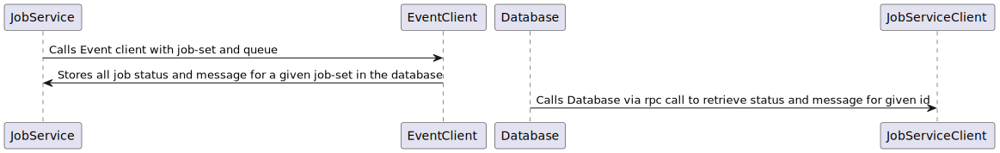

# Armada Job Service

## Problem Description
Armada’s API is event driven, preventing it from integrating with tools, such as Apache Airflow, written with the expectation that it can easily fetch status of a running job. It is not scalable to have Airflow subscribe to the event stream to observe status, so we must implement a caching layer which will expose a friendlier API for individual job querying.

## Proposed Change
### Notes
- Add an optional caching API and service to Armada
- Caches job_id:(job_status, message) relationship for subscribed (queue,job_set) tuples
- Service is written in Go for performance and to reuse code from armadactl

### Proposed Airflow Operator flow
1. Create the job_set
2. [do the work to schedule the job]
3. Status polling loop that talks to job service

## Alternative Options

### Change Armada API
Armada could expose a direct endpoint allowing access to status of a running job.
A previous iteration of Armada did provide an endpoint to get status of a running job.  This was found to be a bottleneck for scaling to large number of jobs and/or users.  The switch to an event API was used to alleviate this performance issue.

### Change Airflow DAG API
Airflow could be modified to allow alternate forms of integration which work better with event-based systems.
This is impractical because we do not have Airflow contributors on staff, and the timeline required to get such a change proposed, approved, and merged upstream is much too long and includes lots of risk.
 
## Data Access
- Service will need to insert job-id and state for a given queue and job-set
- Service will need to delete all jobs for a given queue and job-set.
- Service will access by job-id for polling loop.
- We will use in an in memory cache while doing subscription and then write to a persistent DB periodically.
- We will delete data after a configuration amount of time without an update.
## Data Model
 - The Job Service will contain a table of queue, job-set, job-id, state and timestamp.
 - What database should store this?
    - We will use SQLLite.
    - A in memory database will be used to get job-sets and then we will write in batches to our database for persistence.
### SQLLite
Pros
  - Lightweight
  - In memory db
  - Part of service
  - Persists database to a file
  - SQL operations for inserting and deleting are simple.

Cons
  - Writing is sequential and blocks.
  - Meant for small amount of concurrent users.
  - Difficult to scale with Kubernetes.
  - Scaling is only possible by increasing the number of job services
  - Logic for deleting is more complicated.
  - Writing to virtualized file volume will be slow in Kubernetes.

## API (impact/changes?)
- What should be the API between Armada cache <-> Airflow?
  - The proto file above will generate a python client where they can call get_job_status with job_id, job_set_id and queue specified.  All of these are known by the Airflow Operator.
  - [API Definition](https://github.com/armadaproject/armada/blob/master/pkg/api/jobservice/jobservice.proto)
- JobSet subscription will happen automatically for all tasks in a dag.   

## Security Impact

The cache should use the same security as our armadactl.  Airflow does not currently support multitenancy.  

## Documentation Impact
- Update dev and quickstart guides
- Update production deployment guides

## Use Cases

### Airflow Operator
1) User creates a dag and assigns a job-set.
2) Dag setup includes ArmadaPythonClient and JobServiceClient
3) Airflow operator takes both ArmadaPythonClient and JobServiceClient
4) Airflow operator submits job via ArmadaPythonClient
5) Airflow operator polls JobServiceClient via GetJobStatus 
6) Once Armada has a terminal event, the airflow task is complete.

### Implementation Plan

I have a PR that implements this [plan](https://github.com/armadaproject/armada/pull/1122).
- Created a jobservice proto definition
- Generated GRPC service for the correspond proto definition
- Created a jobservice cmd that takes an configuration object
- JobService starts a GRPC server
- Added ApiConnection and GRPC configuration parameters

### Subscription

After talking with Chris Martin, I found out that we will be implementing our own redis cache for the events.  We will not be using pulsar, nats, or jetstream to stream events.

The logic for this service should be as follows:

- When a request comes in, check if we already have a subscription to that jobset.
If we don't have a subscription, create one using the armada go client (grpc api).
- Have a function connected to this subscription that updates the jobId key in the local cache with the new state for all jobs in the jobset (even those nobody has asked for yet).  
- The local redis should just store jobId -> state mappings.  Any messages you get that don't correspond to states we care about (ingresses, unableToSchedule) just ignore.
- Return the latest state.  If we just subscribed then it's probably "not found"
The armada operator just polls for the job state. The first poll for a given jobset will cause a subscription to be made for that jobset.

### Airflow Sequence Diagram

### JobService Server Diagram

- EventClient is the GRPC public GRPC client for watching events

- The JobService deployment consists of a GRPC Go Server and a database.
