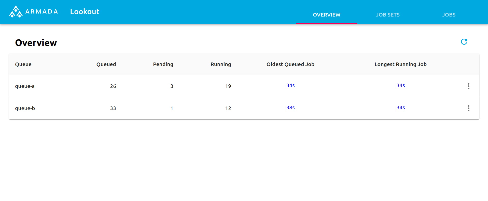

# Armada Demo

This guide will show you how to take a quick test drive of an Armada
instance already deployed to AWS EKS.

## EKS

The Armada UI (lookout) can be found at this URL:

- [https://ui.demo.armadaproject.io](https://ui.demo.armadaproject.io)

## Local prerequisites

- Git
- Go 1.18

## Obtain the armada source
Clone [this](https://github.com/armadaproject/armada) repository:

```bash
git clone https://github.com/armadaproject/armada.git
cd armada
```

All commands are intended to be run from the root of the repository.

## Setup an easy-to-use alias
```bash
alias armadactl='go run cmd/armadactl/main.go --armadaUrl armada.demo.armadaproject.io:443'
```

## Create queues and jobs
Create queues, submit some jobs, and monitor progress:

### Queue Creation
```bash
armadactl create queue queue-a --priorityFactor 1
armadactl create queue queue-b --priorityFactor 2
```

For queues created in this way, user and group owners of the queue have permissions to:
- submit jobs
- cancel jobs
- reprioritize jobs
- watch queue

For more control, queues can be created via `armadactl create`, which allows for setting specific permission; see the following example.

```bash
armadactl create -f ./docs/quickstart/queue-a.yaml
armadactl create -f ./docs/quickstart/queue-b.yaml
```

### Job Submission
```
armadactl submit ./docs/quickstart/job-queue-a.yaml
armadactl submit ./docs/quickstart/job-queue-b.yaml
```

### Monitor Job Progress

```bash
armadactl watch queue-a job-set-1
```
```bash
armadactl watch queue-b job-set-1
```

Try submitting lots of jobs and see queues get built and processed:

```bash
for i in {1..50}
do
  armadactl submit ./docs/quickstart/job-queue-a.yaml
  armadactl submit ./docs/quickstart/job-queue-b.yaml
done
```

## Observing job progress

CLI:

```bash
$ armadactl watch queue-a job-set-1
Watching job set job-set-1
Nov  4 11:43:36 | Queued:   0, Leased:   0, Pending:   0, Running:   0, Succeeded:   0, Failed:   0, Cancelled:   0 | event: *api.JobSubmittedEvent, job id: 01drv3mey2mzmayf50631tzp9m
Nov  4 11:43:36 | Queued:   1, Leased:   0, Pending:   0, Running:   0, Succeeded:   0, Failed:   0, Cancelled:   0 | event: *api.JobQueuedEvent, job id: 01drv3mey2mzmayf50631tzp9m
Nov  4 11:43:36 | Queued:   1, Leased:   0, Pending:   0, Running:   0, Succeeded:   0, Failed:   0, Cancelled:   0 | event: *api.JobSubmittedEvent, job id: 01drv3mf7b6fd1rraeq1f554fn
Nov  4 11:43:36 | Queued:   2, Leased:   0, Pending:   0, Running:   0, Succeeded:   0, Failed:   0, Cancelled:   0 | event: *api.JobQueuedEvent, job id: 01drv3mf7b6fd1rraeq1f554fn
Nov  4 11:43:38 | Queued:   1, Leased:   1, Pending:   0, Running:   0, Succeeded:   0, Failed:   0, Cancelled:   0 | event: *api.JobLeasedEvent, job id: 01drv3mey2mzmayf50631tzp9m
Nov  4 11:43:38 | Queued:   0, Leased:   2, Pending:   0, Running:   0, Succeeded:   0, Failed:   0, Cancelled:   0 | event: *api.JobLeasedEvent, job id: 01drv3mf7b6fd1rraeq1f554fn
Nov  4 11:43:38 | Queued:   0, Leased:   1, Pending:   1, Running:   0, Succeeded:   0, Failed:   0, Cancelled:   0 | event: *api.JobPendingEvent, job id: 01drv3mey2mzmayf50631tzp9m
Nov  4 11:43:38 | Queued:   0, Leased:   0, Pending:   2, Running:   0, Succeeded:   0, Failed:   0, Cancelled:   0 | event: *api.JobPendingEvent, job id: 01drv3mf7b6fd1rraeq1f554fn
Nov  4 11:43:41 | Queued:   0, Leased:   0, Pending:   1, Running:   1, Succeeded:   0, Failed:   0, Cancelled:   0 | event: *api.JobRunningEvent, job id: 01drv3mf7b6fd1rraeq1f554fn
Nov  4 11:43:41 | Queued:   0, Leased:   0, Pending:   0, Running:   2, Succeeded:   0, Failed:   0, Cancelled:   0 | event: *api.JobRunningEvent, job id: 01drv3mey2mzmayf50631tzp9m
Nov  4 11:44:17 | Queued:   0, Leased:   0, Pending:   0, Running:   1, Succeeded:   1, Failed:   0, Cancelled:   0 | event: *api.JobSucceededEvent, job id: 01drv3mf7b6fd1rraeq1f554fn
Nov  4 11:44:26 | Queued:   0, Leased:   0, Pending:   0, Running:   0, Succeeded:   2, Failed:   0, Cancelled:   0 | event: *api.JobSucceededEvent, job id: 01drv3mey2mzmayf50631tzp9m
```

Web UI:

Open [https://ui.demo.armadaproject.io](https://ui.demo.armadaproject.io) in your browser.


