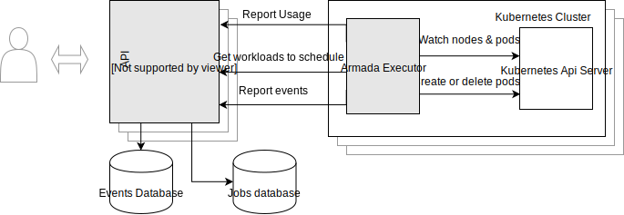

# System overview

This document is meant to be an overview of Armada for new users. We cover the architecture of Armada, show how jobs are represented, and explain how jobs are queued and scheduled.

If you just want to learn how to submit jobs to Armada, see:

- [User guide](./user.md)

## Architecture

Armada consists of two main components:
- The Armada server, which is responsible for accepting jobs from users and deciding in what order, and on which Kubernetes cluster, jobs should run. Users submit jobs to the Armada server through the `armadactl` command-line utility or via a gRPC or REST API. 
- The Armada executor, of which there is one instance running in each Kubernetes cluster that Armada is connected to. Each Armada executor instance regularly notifies the server of how much spare capacity it has available and requests jobs to run. Users of Armada never interact with the executor directly.

All state relating to the Armada server is stored in [Redis](https://redis.io/), which may use replication combined with failover for redundancy. Hence, the Armada server is itself stateless and is easily replicated by running multiple independent instances. Both the server and the executors are intended to be run in Kubernetes pods. We show a diagram of the architecture below.



### Job leasing

To avoid jobs being lost if a cluster (or cluster executor) becomes unavailable, each job assigned to an executor has an associated timeout. Armada executors are required to check in with the server regularly and, if an executor responsible for running a particular job fails to check in within that timeout, the server will re-schedule the job over another executor.

## Jobs and job sets

A job is the most basic unit of work in Armada, and is represented by a Kubernetes pod specification (podspec) with additional metadata specific to Armada. Armada handles creating, running, and removing containers as necessary for each job. Hence, Armada is essentially a system for managing the life cycle of a set of containerised applications representing a batch job. 

The Armada workflow is:

1. Create a job specification, which is a Kubernetes podspec with a few additional metadata fields.
2. Submit the job specification to one of Armada's job queues using the `armadactl` CLI utility or through the Armada gRPC or REST API.

For example, a job that sleeps for 60 seconds could be represented by the following yaml file.

```yaml
queue: test
jobSetId: set1
jobs:
  - priority: 0
    podSpecs:
      - terminationGracePeriodSeconds: 0
        restartPolicy: Never
        containers:
          - name: sleep
            imagePullPolicy: IfNotPresent
            image: busybox:latest
            args:
              - sleep
              - 60s
            resources:
              limits:
                memory: 64Mi
                cpu: 150m
              requests:
                memory: 64Mi
                cpu: 150m
```

In the above yaml snippet, `podSpec` is a Kubernetes podspec, which consists of one or more containers that contain the user code to be run. In addition, the job specification (jobspec) contains metadata fields specific to Armada:

- `queue`: which of the available job queues the job should be submitted to. 
- `priority`: the job priority (lower values indicate higher priority).
- `jobSetId`: jobs with the same `jobSetId` can be followed and cancelled in a single operation. The `jobSetId` has no impact on scheduling.

Queues and scheduling is explained in more detail below.

For more examples, including of jobs spanning multiple nodes, see the [user guide](./user.md).

### Job events

A job event is generated whenever the state of a job changes (e.g., when changing from submitted to running or from running to completed) and is a timestamped message containing event-specific information (e.g., an exit code for a completed job). All events generated by jobs part of the same job set are grouped together and published via a [Redis stream](https://redis.io/topics/streams-intro). There are unique streams for each job set to facilitate subscribing only to events generated by jobs in a particular set, which can be done via the Armada API.

Armada records all events necessary to reconstruct the state of each job and, after a job has been completed,  the only information retained about the job is the events generated by it.

## Queues and scheduling

An Armada cluster is configured with one or more queues, to which jobs may be submitted. For example, each user, team, or project may be given separate queues. Armada makes a scheduling decision whenever one of the executors residing in one of the underlying Kubernetes notifies the Armada server that it has unused resources available.

Both jobs and queues have a priority factor associated with it, and jobs are scheduled according to the following principles:

- The fraction of resources assigned to each queue is proportional to the inverse of its priority factor. For example, if there are two queues with priority 1 and 2, respectively, the first queue will, on average, be assigned a fraction 1/3 of resources and the second a fraction 2/3 of resources.
- Within each queue, jobs with higher priority (i.e., with a lower priority factor) are scheduled before lower-priority jobs (i.e., with a higher priority factor), provided there are sufficient available resources in one of the Kubernetes clusters to run the higher-priority job.

Note that lower-priority jobs may be scheduled before higher-priority jobs if there are insufficient resources to run the high-priority job and the lower-priority job requires fewer resources.

### Queue resource usage and priority

Whenever the Armada server is about to make a scheduling decision, it first prioritises each queue based on its current overall resource usage and the priority factor associated with the queue. For each queue, its overall resource usage is computed as a weighted sum of the amount of each available resource, e.g., CPU, GPU, and memory, currently allocated to jobs originating from that queue. The weight for each resource type is equal to the amount of that resource type per CPU.

For example, if a cluster has 10 CPUs, 5 GPUs, and 20Gb of memory, the weights are:

- GPU weight: `5 / 10 = 0.5`
- Memory weight: `20 / 10 = 2`

CPU always has weight `1`.

Now, if the total resource usage by jobs originating from a particular queue is 5 CPU, 1 GPU, and 2 Gb memory, then the overall resource usage of the queue is:

`5 / 1 + 1/ 0.5 + 2 / 2 = 8`

Note that this system extends to resource types other than CPU, GPU, and memory.

After computing the overall resource usage of each queue, the Armada server updates the priority of each queue as follows (inspired by HTCondor):

`priority = priority (1 - beta) + resourceUsage * beta`,

where

`beta = 0.5 ^ (timeChange / priorityHalftime)`,

`resourceUsage` is the current overall resource usage of the queue, `priorityHalftime` is a parameter that controls how quickly the priority converges to the current resource usage of the queue, and `timeChange` is the time since the priority was last updated. Hence, if the resource usage of all queues is constant, the priority of each queue will eventually converge to the resource usage of each queue. 

Next, Armada computes the effective priority of each queue by multiplying the priority computed above by the priority factor associated with each queue, i.e.,

`effectivePriority = priority * priorityFactor`.

Finally, Armade uses the effective priority to decide how to allocate available resources.

### Scheduling algorithm

After computing the effective priority of all queues, Armada attempts to divide the available resources over non-empty queues according to their priority. This process consists of a deterministic stage followed by a probabilistic stage. The deterministic stage can be skipped entirely by configuring the Armada server with `scheduling.useProbabilisticSchedulingForAllResources = true`.

#### Deterministic stage

First, Armada divides all available resources over the non-empty queues such that the fraction of resources assigned to each non-empty queue is proportional to its effective priority. For example, if there are two queues with effective priority `1` and `2`, then those queues are assigned a fraction `1/3` and `2/3` of each resource, respectively. We refer to the per-queue resource allocation as the resource quota of the queue.

Next, Armada schedules jobs to run from each queue until there are no more jobs that can be scheduled without exceeding the resources quotas. For each queue, Armada first attempts to schedule the highest-priority job (i.e., the job with lowest priority factor). If scheduling the highest-priority job would exceed the resource quota of the queue, Armada moves down the list, attempting to schedule the second-highest priority job and so on. This process is repeated at most `queueLeaseBatchSize` times. Lower `queueLeaseBatchSize` speeds up scheduling at the expense of potentially missing jobs further down the queue that would have fit within the quota.

#### Probabilistic stage

Whatever resources remain after the deterministic stage are scheduled using probabilistic slicing, which works as follows.

Armada randomly selects a non-empty queue with probability distribution corresponding to the remainders of queue slices. One job from this queue is scheduled, and the queue slice is reduced. This process is repeated until there is are no resources available, all queues are empty, or a time limit has been exceeded.

Note that there is a chance than one queue will get allocated more than it is entitled to. However, the average resource usage of each queue over a sufficiently large number of jobs will be close to the priority factor of the queue.

### Permissions

Armada allows for setting user and group permissions for each queue via the `owners` and `groupOwners` options, respectively. Job set events can be seen by all users with `watch_all_events` permissions.

If the `kubernetes.impersonateUsers` flag is set, Armada will create pods in Kubernetes under the username of the job owner, which will enforce Kubernetes permissions and limit access to namespaces.

### Resource limits

Each queue can have resource limits associated with it, which limit the resources consumed by the jobs from the queue to some percentage of all available resources at each point of time. For example, this prevents users from submitting long-running jobs during a period with low utilization that consume all resources in the cluster.
