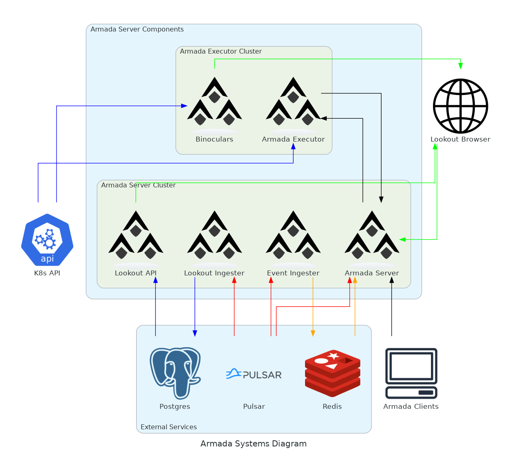

# Diagrams of Armada Architecture

## Generating the Diagram

To generate this diagram, you can use the following command:

```bash
# install graphviz
sudo apt-get install graphviz

# then install diagrams from pip
pip install diagrams

# then run the following command to generate the diagram
python3 generate.py
```

To find out more about the diagrams library, see https://diagrams.mingrammer.com/
To find out more about the graphviz library, see https://graphviz.org/

## Systems Diagram



This diagram shows the high-level architecture of Armada. It is made of 4 parts:

### Armada Server Components

These are the components that control the operation of the different executors across different k8s clusters (See https://armadaproject.io/design)

It includes:
- **Armada Server**: The main component of Armada. It is responsible for the scheduling of jobs and the management of the executors.
- **Lookout API**: A component that servers the lookout API, which enables users to monitor the status of jobs and queues.
- **Ingesters**: These move data from pulsar to their respective databases. The Event Ingester moves data from pulsar to redis. The Lookout Ingester moves data from pulsar to postgres for the lookout component to use.

### Armada Executor Components

These are the components that run on each k8s cluster and are responsible for the execution of jobs on that cluster.

It includes:
- **Armada Executor**: The main component of the executor. It is responsible for the execution of jobs on the cluster.
- **Binoculars**: A component that reads from the k8s API to get information about the cluster that can be used by Lookout.

### Armada Client Components

These are the components that are used by users to submit jobs to Armada, using gRPC. Current languages supported are:
- Go
- Python
- C#

### Lookout Frontend

This is the frontend for the lookout component. It is a React application that allows users to monitor the status of jobs and queues.


