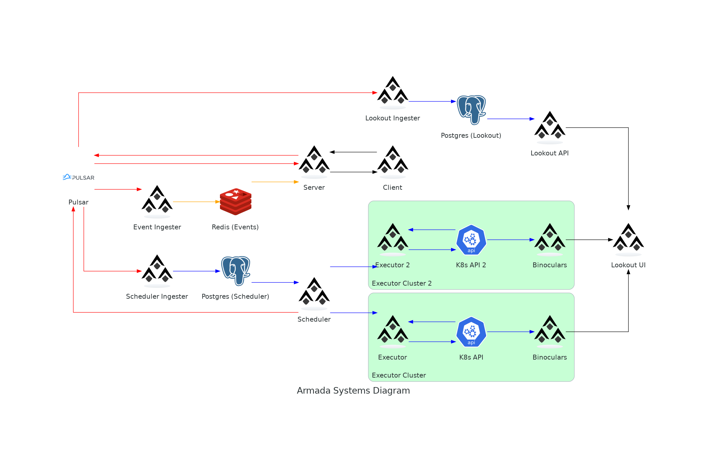

## Relationships Diagram

This diagram shows the high-level relationships between components of Armada and third-party softwares.

### Armada Client

This is the comonent that is used by users to submit jobs to Armada, using gRPC. Current languages supported are:
- Go
- Python
- C#

### Ingester Loops

All data-flows in armada are controlled by pulsar. This means that all data is first written to pulsar, and then ingested into the appropriate database. The ingester loops are the components that read data from pulsar and write it to the appropriate database.

There are 3 ingester loops:
- **Event Ingester**: This ingests data from pulsar into redis.
- **Lookout Ingester**: This ingests data from pulsar into postgres.
- **Scheduler Ingester**: This ingests data from pulsar into postgres.

### Scheduler

The scheduler is the component that is responsible for scheduling jobs.

It receives data from the ingester loops, and then uses that data to schedule jobs. Its decisions are then fed back to pulsar, allowing the process to repeat.

### Armada Executor Components

These are the components that run on each k8s cluster that executes jobs.

It includes:
- **Armada Executor**: The main component of the executor. It is responsible for the execution of jobs on the cluster.
- **Binoculars**: A component that reads logs from the k8s API.

### Lookout

Lookout is made of 2 components:
- **Lookout API**: This is the component that acts as a gateway to the lookout database. It is a gRPC API.
- **Lookout UI**: This is the component that is used by users to query the state of jobs. It is a web UI.
