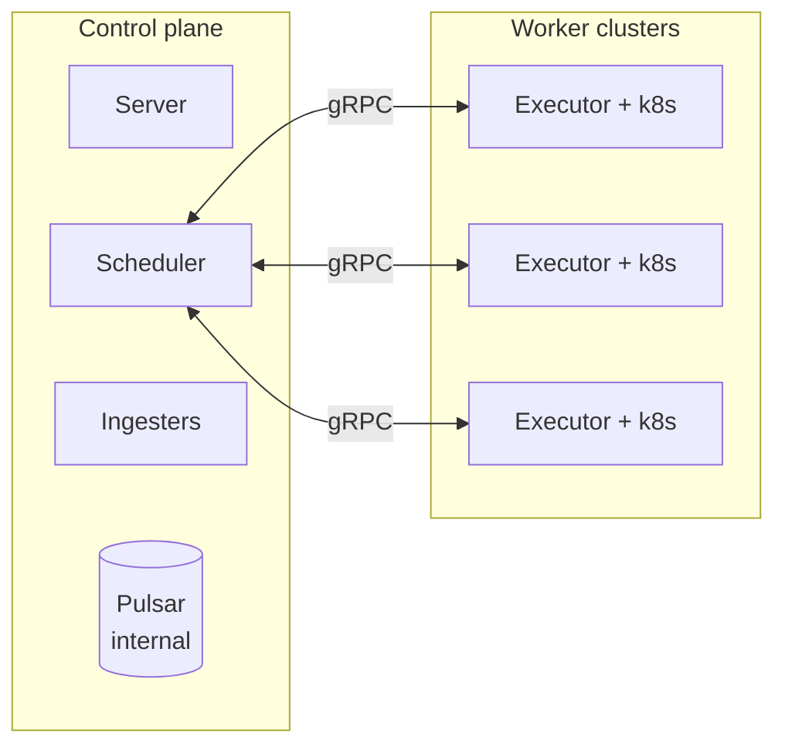
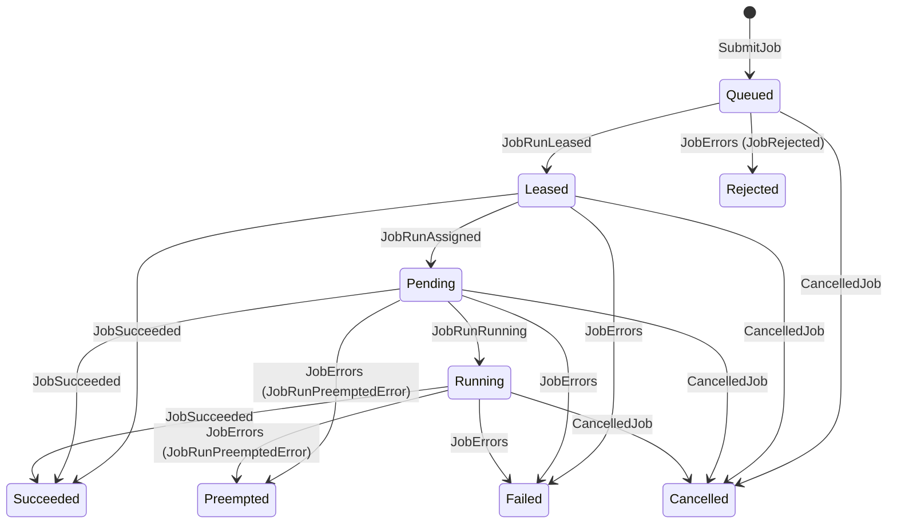
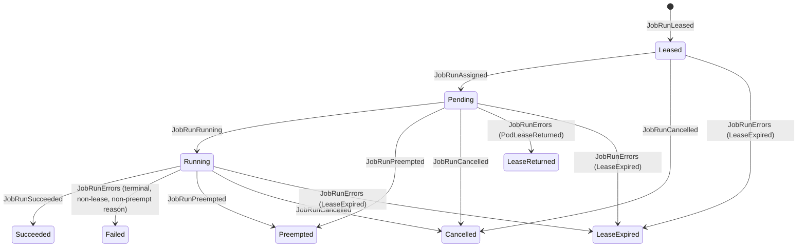
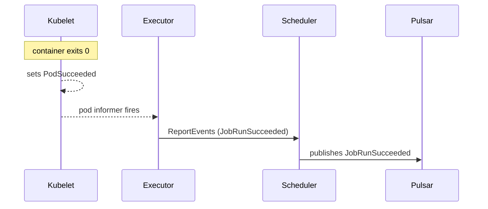
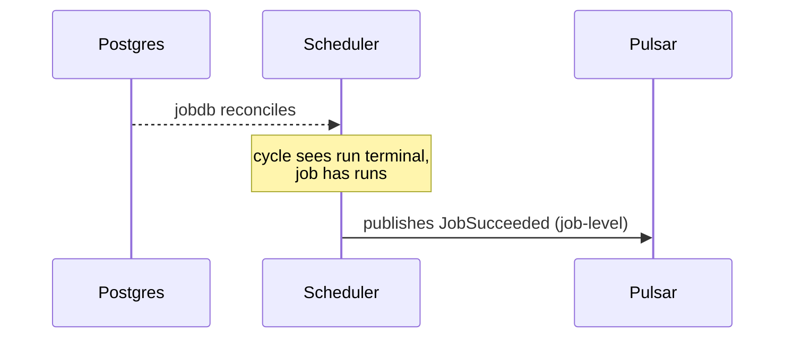
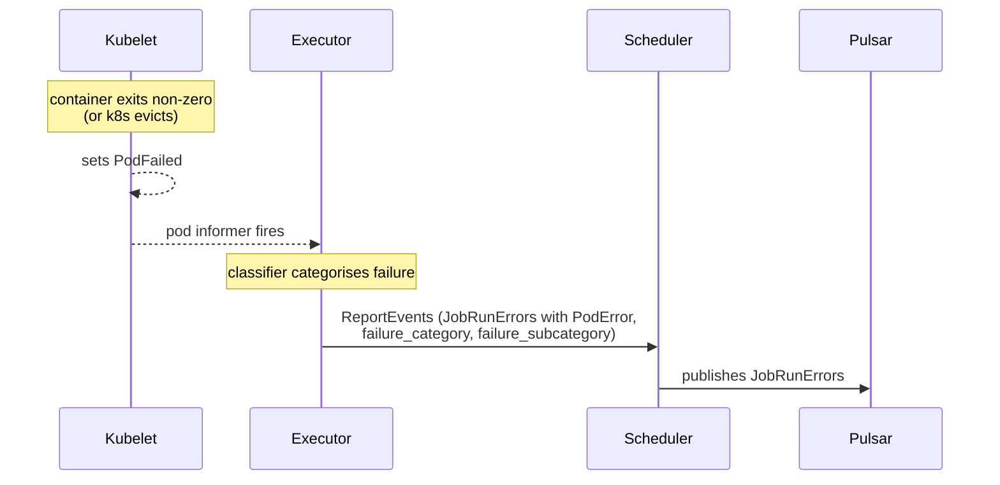
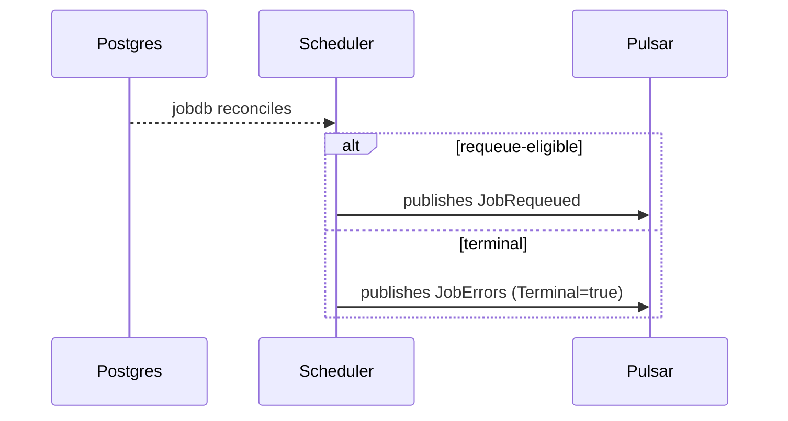
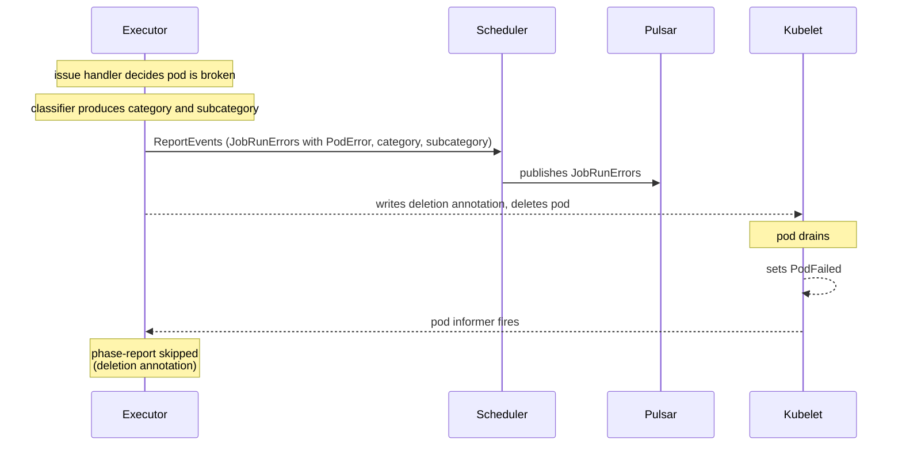
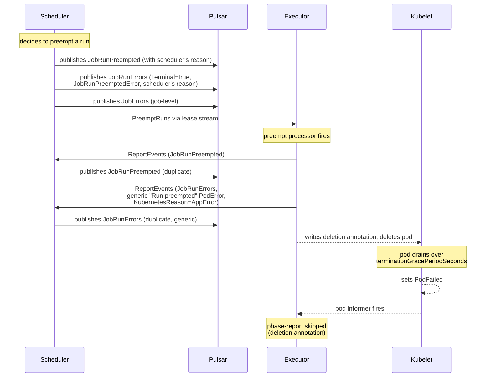
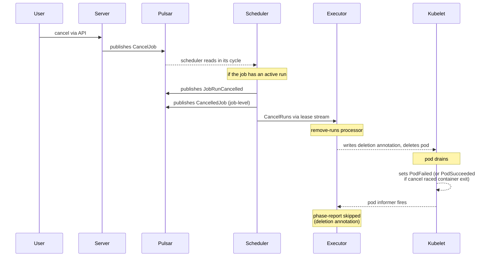

# Job lifecycle: states, transitions, and events

- [Job lifecycle: states, transitions, and events](#job-lifecycle-states-transitions-and-events)
  - [Topology](#topology)
  - [Components](#components)
  - [Transport and edge cases](#transport-and-edge-cases)
  - [State machines](#state-machines)
    - [Job state](#job-state)
    - [Run state](#run-state)
  - [Event vocabulary](#event-vocabulary)
  - [Job succeeded](#job-succeeded)
  - [Job failed](#job-failed)
    - [Path A: pod reaches terminal phase](#path-a-pod-reaches-terminal-phase)
    - [Path B: executor's issue handler detects a problem first](#path-b-executors-issue-handler-detects-a-problem-first)
  - [Job preempted](#job-preempted)
    - [Known issues](#known-issues)
  - [Job cancelled](#job-cancelled)

Armada's job and run lifecycle is event-driven. This doc covers the architecture, the state machines, the events that drive transitions, and the four terminal flows: succeeded, failed, preempted, cancelled.

For higher-level context on scheduling and preemption mechanics, see [scheduling_and_preempting_jobs.md](../scheduling_and_preempting_jobs.md).

## Topology

Armada is a multi-cluster system. The control plane runs once, centrally. Each worker Kubernetes cluster runs its own executor process.

Pulsar is the control plane's internal event bus. Server and scheduler publish to Pulsar. The ingesters consume from it. Executors do not interact with Pulsar directly.

Executors reach the control plane through one gRPC service, `ExecutorApi`, served by the scheduler:

- **`LeaseJobRuns`**: a bidirectional stream initiated by the executor. The executor sends `LeaseRequest` messages with its current state and capacity. The scheduler sends back `LeaseStreamMessage` values containing new leases, cancel-runs instructions, preempt-runs instructions, or end markers.
- **`ReportEvents`**: a unary call. The executor sends batches of run-level event sequences to the scheduler. The scheduler's handler authorises the caller and republishes the events to Pulsar.

This matters for the preempt flow below: a single logical action can trigger two separate Pulsar publications, one from the scheduler directly and one relayed from the executor via `ReportEvents`. The two paths converge at Pulsar but have no guaranteed ordering relative to each other. The typical-case ordering is driven by the gRPC round trip.

## Components

A run is one attempt to actually start the pod. A job has at most one active run at a time.

Control-plane components:

- **Server.** Accepts job submissions and cancel requests over its gRPC API. Validates them and publishes the resulting events to Pulsar.
- **Scheduler.** Owns scheduling decisions. Maintains an in-memory `jobdb`, reconciled from the scheduler Postgres database on each cycle. Emits its own run-level decision events (`JobRunLeased`, `JobRunPreempted`, `JobRunCancelled`, decision-time `JobRunErrors`) and all job-level events to Pulsar.
- **Scheduler ingester.** Consumes events from Pulsar and writes to the scheduler Postgres database. The database is canonical. `jobdb` is a cached view of it.
- **Lookout ingester.** Consumes the same events independently and writes to the Lookout Postgres database, which drives the Lookout UI.
- **Event ingester.** Consumes events into Redis to back the external event-stream API.

Worker-cluster components:

- **Executor.** One per worker cluster, running inside that cluster. Holds an open `LeaseJobRuns` stream and uses `ReportEvents` to send run events back. Creates and watches pods via the local Kubernetes API. Produces `JobRunAssigned`, `JobRunRunning`, `JobRunSucceeded`, and `JobRunErrors` from observed pod state, plus `JobRunPreempted` and `JobRunErrors` from the preempt processor and issue handler when acting on scheduler instructions.

Before deleting a pod it owns (cancel, preempt, or detected issue), the executor writes the `deletion_requested` annotation (`domain.MarkedForDeletion`). The state reporter's informer path then skips terminal-phase reporting for annotated pods, preventing a duplicate terminal event for pods the executor is itself killing.

## Transport and edge cases

A few transport-level behaviours affect how the flows below behave under failure.

**Executor event reporting is buffered, batched, and not retried at the reporter level.** The job-event reporter buffers events in a 1M-slot channel, drains every two seconds or when the batch fills, and sends each batch through one `ReportEvents` call. On failure, per-event callbacks see the error but the reporter itself does not retry. Retries happen one layer up. The state reporter's reconciliation pass re-emits terminal-phase events for pods whose current phase has not been marked reported. The issue handler retries via its in-process `Reported` marker, which is lost on executor restart. The preempt processor retries via the `JobPreemptedAnnotation` pod annotation, which survives restart. Both handlers only set their marker after a successful `Report`, so a failed call gets retried on the next handler tick.

**Lease expiry is detected by the scheduler from executor heartbeat staleness.** Executors send `LeaseRequest` messages over the `LeaseJobRuns` stream as their heartbeat. The scheduler tracks the last time it heard from each executor. When an executor goes stale (no heartbeat within the scheduler's `executorTimeout`), the next scheduling cycle iterates jobs whose latest run belongs to that executor and emits `JobRunErrors` with a `LeaseExpired` reason for each one. The scheduler cannot distinguish "executor went away" from "stream momentarily lost". It acts on the heartbeat absence either way.

**Pulsar redelivery is effectively idempotent at the ingesters' terminal-state writes.** `MarkRunsSucceeded`, `MarkRunsFailed`, and `MarkRunsPreempted` write timestamps taken from each event's `Created` field. A redelivered event carries the same `Created` value as the original, so a duplicate write produces the same column value. The `job_run_errors` table is upserted on `run_id`, so a redelivered `JobRunErrors` overwrites with identical bytes. `JobRunCancelled` is not written to the runs table at all by the scheduler ingester (it is in the explicit ignore list). Job-level cancellation is tracked separately via `CancelledJob` and `MarkJobsCancelled`. The exception to this idempotence is the preempt flow's double emission described in [Preempted known issues](#known-issues): there the second emission is a different event with different content, not a redelivery.

## State machines

Armada surfaces state at two levels: per job and per run. The public-facing vocabulary lives in Lookout's enums, defined in `internal/common/database/lookout/jobstates.go`.

The scheduler's internal model tracks boolean flags (`queued`, `failed`, `succeeded`, `cancelled`, plus `validated` for pre-queue validation) rather than a single state value. The mutually-exclusive states are Queued, Running, Cancelled, Failed, and Succeeded. From Queued, the job can transition to Running, Cancelled, or Failed. From Running, it can transition to Queued (requeue), Cancelled, Failed, or Succeeded. The scheduler's `Running` collapses Lookout's `Leased`, `Pending`, and `Running` into one. `Preempted` and `Rejected` are surfaced by Lookout from the reason inside a `JobErrors` event, not as scheduler-internal states. The tables below show the Lookout view, which is what API consumers see.

### Job state

| From                                | To        | Driven by                                       |
| ----------------------------------- | --------- | ----------------------------------------------- |
| (new)                               | Queued    | server publishes `SubmitJob`                    |
| Queued                              | Leased    | `JobRunLeased`                                  |
| Leased                              | Pending   | `JobRunAssigned`                                |
| Pending                             | Running   | `JobRunRunning`                                 |
| Leased / Pending / Running          | Succeeded | `JobSucceeded`                                  |
| Leased / Pending / Running          | Failed    | `JobErrors` (Terminal=true, default case)       |
| Pending / Running                   | Preempted | `JobErrors` with `JobRunPreemptedError` reason  |
| Queued                              | Rejected  | `JobErrors` with `JobRejected` reason           |
| Queued / Leased / Pending / Running | Cancelled | `CancelledJob`                                  |

### Run state

| From                       | To            | Driven by                                                                                           |
| -------------------------- | ------------- | --------------------------------------------------------------------------------------------------- |
| (new)                      | Leased        | `JobRunLeased`                                                                                      |
| Leased                     | Pending       | `JobRunAssigned`                                                                                    |
| Pending                    | Running       | `JobRunRunning`                                                                                     |
| Running                    | Succeeded     | `JobRunSucceeded`                                                                                   |
| Running                    | Failed        | `JobRunErrors` with any reason except `PodLeaseReturned`, `LeaseExpired`, or `JobRunPreemptedError` |
| Pending / Running          | Preempted     | `JobRunPreempted`                                                                                   |
| Leased / Pending / Running | Cancelled     | `JobRunCancelled`                                                                                   |
| Pending                    | LeaseReturned | `JobRunErrors` (`PodLeaseReturned`)                                                                 |
| Leased / Pending / Running | LeaseExpired  | `JobRunErrors` (`LeaseExpired`, emitted on stale executor)                                          |

`MaxRunsExceeded`, `UnableToSchedule`, and `Terminated` exist as enum values in the Lookout run-state enum but are not driven by any current emission path. When the scheduler caps retries with a `MaxRunsExceeded` reason, lookout's `JobRunErrors` handler falls into the default case and records the run as `Failed`.

## Event vocabulary

A reference for the events used in the flows below.

**Run-level internal events** describe what happened to a single run.

| Event             | Emitted by              | Carries                                                                                                    |
| ----------------- | ----------------------- | ---------------------------------------------------------------------------------------------------------- |
| `JobRunLeased`    | scheduler               | executor ID, node ID, scheduling priority                                                                  |
| `JobRunAssigned`  | executor                | pod identity (node name, pod number), pool                                                                 |
| `JobRunRunning`   | executor                | pod identity, pool                                                                                         |
| `JobRunSucceeded` | executor                | pod identity                                                                                               |
| `JobRunErrors`    | executor or scheduler   | one or more `Error` values (reason discriminated by oneof) plus optional `failure_category`/`_subcategory` |
| `JobRunPreempted` | scheduler then executor | preempted run ID, preemption reason text                                                                   |
| `JobRunCancelled` | scheduler               | run ID, job ID                                                                                             |

The `Error.reason` oneof inside `JobRunErrors` has eleven variants: `KubernetesError`, `ContainerError`, `ExecutorError`, `LeaseExpired`, `MaxRunsExceeded`, `PodError`, `PodLeaseReturned`, `JobRunPreemptedError`, `GangJobUnschedulable`, `JobRejected`, `ReconciliationError`.

**Job-level internal events** are emitted by the scheduler when it concludes the job itself reaches a terminal state or is being requeued, usually one scheduling cycle after the corresponding run-level event lands in the database.

| Event          | Emitted by | Carries                                                                              |
| -------------- | ---------- | ------------------------------------------------------------------------------------ |
| `JobSucceeded` | scheduler  | job ID                                                                               |
| `JobErrors`    | scheduler  | one or more `Error` values, where the reason discriminates Failed/Preempted/Rejected |
| `CancelledJob` | scheduler  | job ID, cancel reason, cancelling user                                               |
| `JobRequeued`  | scheduler  | job ID, updated scheduling info, queued version                                      |

**External API events** are what watchers of the event-stream API see. The conversion layer maps internal events to external events. Some internal events have no external counterpart and are silently ignored.

| Internal event             | External event                                    | Notes                                                                                                       |
| -------------------------- | ------------------------------------------------- | ----------------------------------------------------------------------------------------------------------- |
| `JobSucceeded` (job-level) | `JobSucceededEvent`                               |                                                                                                             |
| `JobErrors` (job-level)    | `JobFailedEvent` (for terminal)                   | Carries reason, category, subcategory.                                                                      |
| `CancelledJob`             | `JobCancelledEvent`                               |                                                                                                             |
| `JobRunPreempted`          | `JobPreemptedEvent`                               |                                                                                                             |
| `JobRunErrors`             | `JobLeaseReturnedEvent` or `JobLeaseExpiredEvent` | Only for `PodLeaseReturned` and `LeaseExpired` reasons. All other reasons ignored at the conversion layer.  |
| `JobRunSucceeded`          | (none, ignored)                                   | API watchers see success via the job-level `JobSucceeded`.                                                  |
| `JobRunCancelled`          | (none, ignored)                                   | API watchers see cancellation via the job-level `CancelledJob`.                                             |

API watchers see the success or failure of a job only after the scheduler has emitted its job-level event, which is one scheduling cycle later than when the run actually finished. Lookout, which consumes the run-level events directly, updates the run-state column promptly and the job-state column with the same lag.

## Job succeeded

- **Run state:** `Running` to `Succeeded`.
- **Job state:** to `Succeeded`, from any non-terminal state.

Events fired in this flow:

| Event             | Phase | Emitted by | Payload      |
| ----------------- | ----- | ---------- | ------------ |
| `JobRunSucceeded` | 1     | executor   | pod identity |
| `JobSucceeded`    | 2     | scheduler  | job ID       |

Phase 1, observation, the executor:

The scheduler ingester writes `runs.succeeded = true, terminated_timestamp`. The lookout ingester writes the run state.

Phase 2, conclusion, the scheduler:

The scheduler ingester writes `jobs.succeeded = true`. The lookout ingester writes the job state. The conversion layer ignores `JobRunSucceeded` and converts `JobSucceeded` to `JobSucceededEvent` for the external API stream.

## Job failed

Two emission paths reach this flow, depending on who detected the failure.

### Path A: pod reaches terminal phase

- **Run state:** `Running` to `Failed`.
- **Job state:** to `Failed` if terminal, or stays non-terminal if requeued.

Events fired in this flow:

| Event          | Phase | Emitted by | Payload                                                       |
| -------------- | ----- | ---------- | ------------------------------------------------------------- |
| `JobRunErrors` | 1     | executor   | `PodError` reason, `failure_category`, `failure_subcategory`  |
| `JobErrors`    | 2     | scheduler  | reason copied from the `JobRunErrors`, Terminal=true          |
| `JobRequeued`  | 2     | scheduler  | (alternative to `JobErrors` when the run is requeue-eligible) |

Phase 1, observation, the executor:

The scheduler ingester writes `runs.failed = true, terminated_timestamp` and inserts a row into `job_run_errors`. The lookout ingester writes the run state.

Phase 2, conclusion, the scheduler:

"Requeue" here is conditional. A failed run is only requeue-eligible if it was *returned*, meaning the run carried a `PodLeaseReturned` error (the executor never successfully ran the pod, typically because the cluster could not honour the lease). Failures with a `PodError` reason are not requeued. The job is marked failed on the next cycle. Returned runs are additionally gated on two configuration knobs: the per-job `armadaproject.io/failFast` annotation must be unset, and the job's attempt count must be below the scheduler-wide `maxAttemptedRuns` cap.

The conversion layer converts the scheduler's job-level `JobErrors` to `JobFailedEvent` for the API stream. The executor's `JobRunErrors` does not produce an external API event for `PodError`-reason failures. It only does so for `LeaseExpired` and `PodLeaseReturned`.

### Path B: executor's issue handler detects a problem first

The issue handler watches managed pods for failure modes that surface before the pod's terminal phase. Its `podIssueType` enum has seven values: `UnableToSchedule`, `StuckStartingUp`, `FailedStartingUp`, `StuckTerminating`, `ActiveDeadlineExceeded`, `ExternallyDeleted`, and `ErrorDuringIssueHandling`. When it decides a pod is broken, it emits the failure event at detection time and then deletes the pod.

Events fired in this flow:

| Event          | Phase | Emitted by | Payload                                                                                                          |
| -------------- | ----- | ---------- | ---------------------------------------------------------------------------------------------------------------- |
| `JobRunErrors` | 1     | executor   | `PodError` (or `PodLeaseReturned` for retryable issues) reason, category, subcategory                            |
| `JobErrors`    | 2     | scheduler  | reason copied from the `JobRunErrors`, Terminal=true                                                             |
| `JobRequeued`  | 2     | scheduler  | (alternative to `JobErrors` when the issue produced a `PodLeaseReturned` and the run is otherwise eligible)      |

The state reporter skips re-emitting on the terminal-phase tick because the pod is marked for deletion. Downstream from there it matches path A: the scheduler ingester writes the run as failed, the scheduler concludes the job's fate on a later cycle, and the conversion layer surfaces a `JobFailedEvent` if the result was terminal.

This path differs from path A in timing only. `JobRunErrors` is emitted at detection time, not at pod-drain time. The gap between event emission and the pod actually stopping can be tens of seconds when Kubernetes honours a long `terminationGracePeriodSeconds` before SIGKILL.

## Job preempted

- **Run state:** `Pending` or `Running` to `Preempted`.
- **Job state:** to `Preempted`, once the scheduler emits the job-level `JobErrors` with `JobRunPreemptedError` reason.

Known emission issues are detailed in [Known issues](#known-issues) below.

Events fired in this flow:

| Event             | Phase | Emitted by | Payload                                                                   |
| ----------------- | ----- | ---------- | ------------------------------------------------------------------------- |
| `JobRunPreempted` | 1     | scheduler  | preempted run ID, scheduler's preemption reason                           |
| `JobRunErrors`    | 1     | scheduler  | Terminal=true, `JobRunPreemptedError`, scheduler's reason                 |
| `JobErrors`       | 1     | scheduler  | Terminal=true, `JobRunPreemptedError` reason (drives Preempted job state) |
| `JobRunPreempted` | 2     | executor   | (duplicate of the scheduler's, no extra context)                          |
| `JobRunErrors`    | 2     | executor   | Terminal=true, generic `PodError` with message "Run preempted"            |

Each `JobRunPreempted` becomes a `JobPreemptedEvent` on the external API, so watchers see two preempted events per preemption. The executor's `JobRunErrors` is silently dropped by the conversion layer (`PodError` reason is not in the run-level handler's whitelist). The scheduler's `JobErrors` becomes the single `JobFailedEvent`, with the `JobRunPreemptedError` reason driving the Lookout job state to Preempted rather than Failed.

### Known issues

The root cause for both: the scheduler and the executor each emit run-level events for a preemption.

`JobRunPreempted` and `JobRunErrors` are each emitted twice, once by the scheduler at decision time and once by the executor when it processes the preempt instruction. External API watchers see two `JobPreemptedEvent` messages per preemption. They do not see two `JobFailedEvent`, because run-level `JobRunErrors` with `PodError` and `JobRunPreemptedError` reasons are both dropped at the conversion layer. Only the scheduler's job-level `JobErrors` becomes a `JobFailedEvent`.

The scheduler ingester upserts `job_run_errors` keyed on `run_id`, so whichever `JobRunErrors` emission lands second overwrites the first. The executor's emission typically arrives second because of the indirection described in [Topology](#topology). The scheduler publishes its `JobRunErrors` to Pulsar at decision time. It also sends a `PreemptRuns` instruction over the lease stream. The executor receives the instruction, runs its preempt processor, produces its own `JobRunErrors`, and sends it back to the scheduler via `ReportEvents`. The scheduler's handler then publishes that to Pulsar. The lease-stream round trip plus the executor's processing plus the `ReportEvents` call plus the second Pulsar publish all happen in series, so the executor's event reaches Pulsar strictly after the scheduler's in typical operation. Pulsar gives ordering only within a single partition for a single producer, so the "typically second" claim is timing not guarantee.

The executor's `JobRunErrors` is built from a generic helper that produces a `PodError` with the literal text "Run preempted" and a misleading `KubernetesReason: AppError`. When this overwrites the scheduler's row, the specific preemption description (which job caused the eviction, which pool, what fairness violation) is replaced with the generic content. The `MarkRunsFailed` update statement has no `IS NULL` guard, so the second emission also overwrites `runs.terminated_timestamp`.

The lookout ingester is more defensive: it has an explicit `continue` for `JobRunErrors` with `JobRunPreemptedError` reason, with a comment noting that case is handled by `JobRunPreempted`. So the lookout DB does not develop duplicate rows from that specific reason combo, although it does store the executor's later `PodError`-reason emission.

## Job cancelled

- **Run state:** any non-terminal state to `Cancelled`.
- **Job state:** any non-terminal state to `Cancelled`.

Events fired in this flow:

| Event             | Phase | Emitted by | Payload                                       |
| ----------------- | ----- | ---------- | --------------------------------------------- |
| `CancelJob`       | input | server     | job ID, cancel reason                         |
| `JobRunCancelled` | 1     | scheduler  | run ID, job ID (emitted only if a run exists) |
| `CancelledJob`    | 1     | scheduler  | job ID, cancel reason, cancelling user        |

The executor's cancel path emits no events. Cancellation is a clean teardown driven entirely by the scheduler. The scheduler ingester ignores `JobRunCancelled` (it is in the explicit ignore list) and writes job-level cancellation via `MarkJobsCancelled` from `CancelledJob`. The lookout ingester writes both the run and job state. The conversion layer ignores `JobRunCancelled` and converts `CancelledJob` to `JobCancelledEvent` for the API stream.
