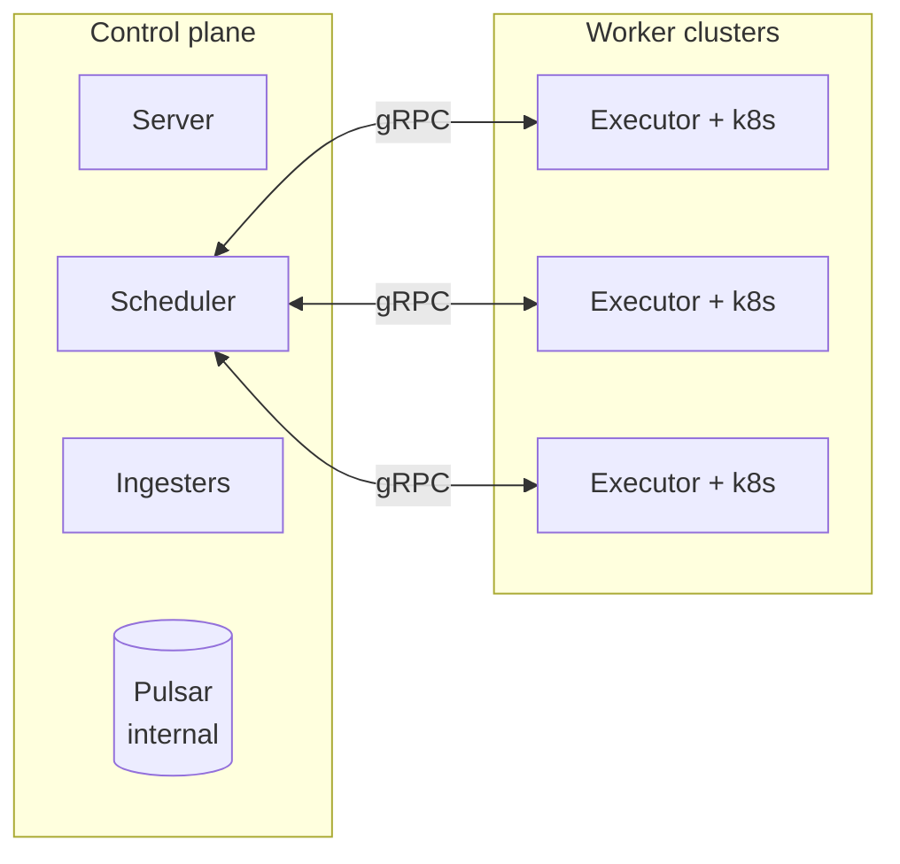
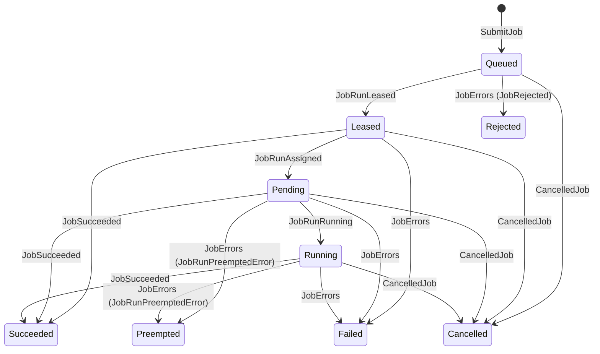
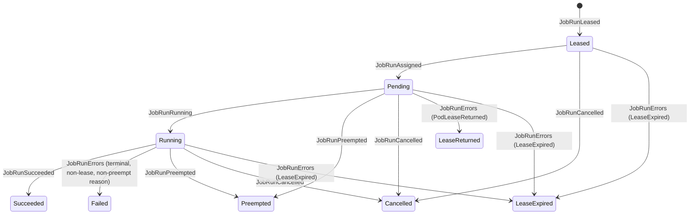
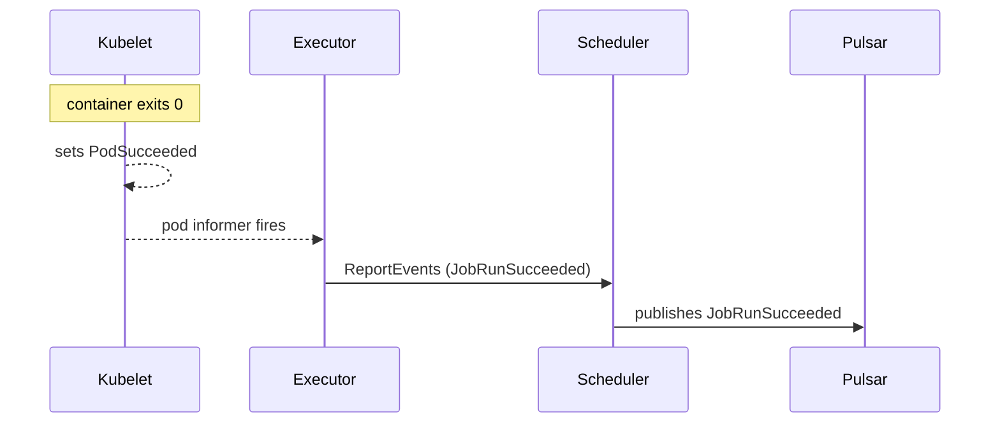
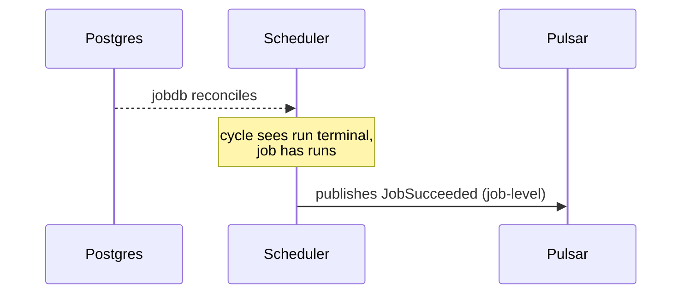
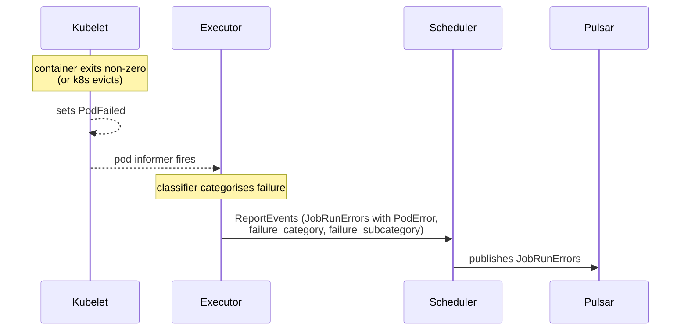
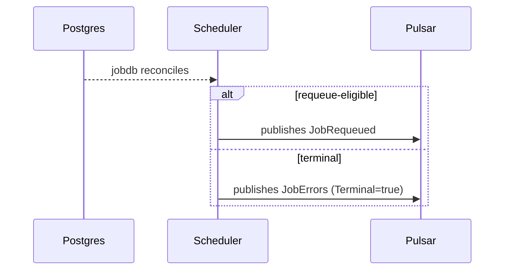
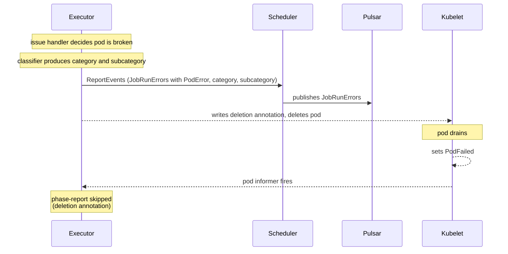
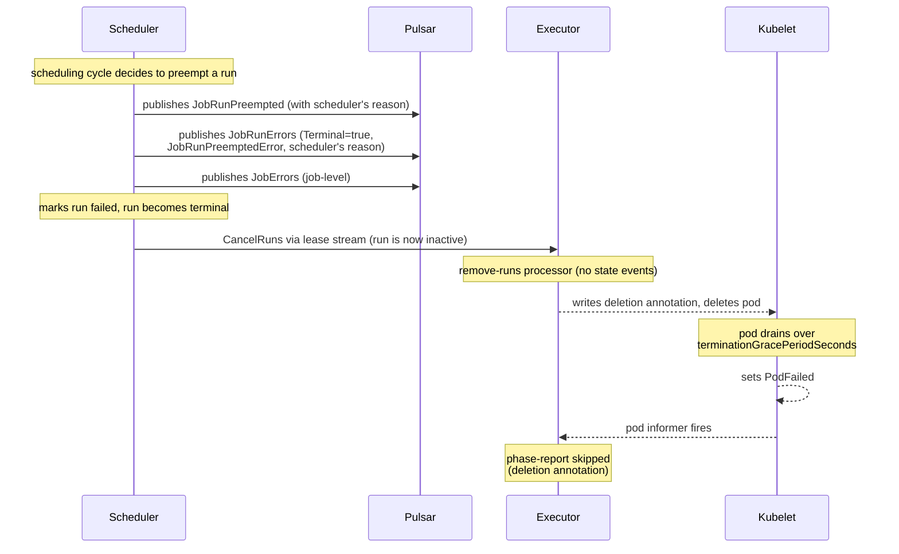
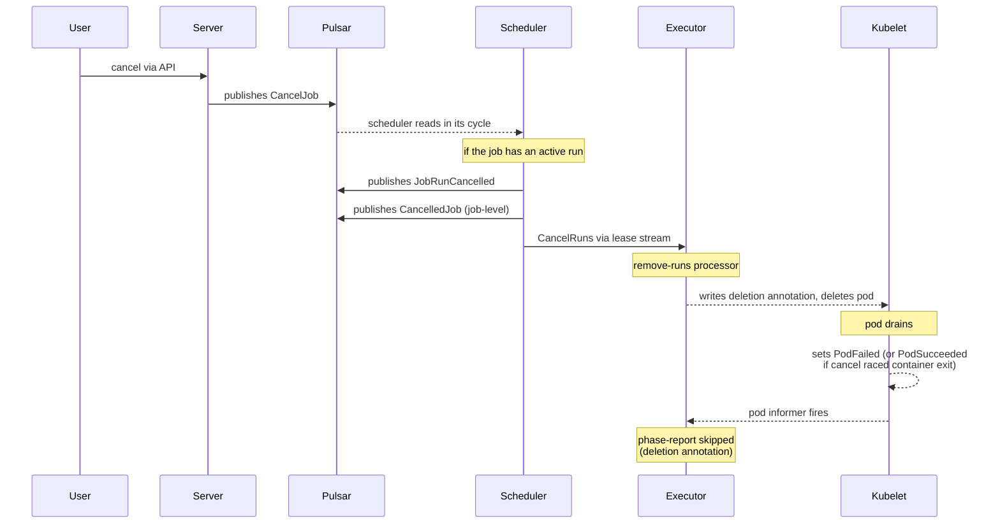

# Job lifecycle: states, transitions, and events

- [Job lifecycle: states, transitions, and events](#job-lifecycle-states-transitions-and-events)
  - [Topology](#topology)
  - [Components](#components)
  - [Transport and edge cases](#transport-and-edge-cases)
  - [State machines](#state-machines)
    - [Job state](#job-state)
    - [Run state](#run-state)
  - [Event vocabulary](#event-vocabulary)
  - [Job succeeded](#job-succeeded)
  - [Job failed](#job-failed)
    - [Path A: pod reaches terminal phase](#path-a-pod-reaches-terminal-phase)
    - [Path B: executor's issue handler detects a problem first](#path-b-executors-issue-handler-detects-a-problem-first)
  - [Job preempted](#job-preempted)
    - [Scheduler-initiated preemption](#scheduler-initiated-preemption)
    - [Run reconciliation and the executor/scheduler double emission](#run-reconciliation-and-the-executorscheduler-double-emission)
  - [Job cancelled](#job-cancelled)

Events drive the job and run lifecycle in Armada. This doc covers the architecture, the state machines, the events that drive transitions, and the four terminal flows: succeeded, failed, preempted, cancelled.

For higher-level context on scheduling and preemption mechanics, see [scheduling_and_preempting_jobs.md](../scheduling_and_preempting_jobs.md).

## Topology

Armada is a multi-cluster system. The control plane runs once, centrally. Each worker Kubernetes cluster runs its own executor process.

```mermaid
flowchart LR
    subgraph CP["Control plane"]
        direction TB
        S[Server]
        Sc[Scheduler]
        I[Ingesters]
        P[(Pulsar<br/>internal)]
    end
    subgraph Workers["Worker clusters"]
        direction TB
        E1[Executor + k8s]
        E2[Executor + k8s]
        E3[Executor + k8s]
    end
    Sc <-->|gRPC| E1
    Sc <-->|gRPC| E2
    Sc <-->|gRPC| E3
```

Pulsar is the internal event bus of the control plane. The server and the scheduler publish to Pulsar. The ingesters consume from it. Executors do not connect to Pulsar.

Executors reach the control plane through one gRPC service, `ExecutorApi`. The scheduler serves this service:

- **`LeaseJobRuns`**: a bidirectional stream. The executor opens the stream and sends one `LeaseRequest` message with its current state and capacity. The scheduler replies with `LeaseStreamMessage` values that contain new leases, cancel-runs instructions, preempt-runs instructions, or end markers. The executor then closes the stream and opens a new one on the next lease cycle.
- **`ReportEvents`**: a unary call. The executor sends batches of run-level event sequences to the scheduler. The handler in the scheduler authorises the caller and republishes the events to Pulsar.

This detail matters for the preempt flow below. One logical action can cause two separate Pulsar publications. One comes from the scheduler directly. The executor relays the other through `ReportEvents`. The two paths converge at Pulsar, and they have no guaranteed order relative to each other. In the typical case, the gRPC round trip sets the order.

## Components

A run is one attempt to start the pod. A job has a maximum of one active run at a time.

Control-plane components:

- **Server.** Accepts job submissions and cancel requests over its gRPC API. It validates the requests and publishes the related events to Pulsar.
- **Scheduler.** Owns scheduling decisions. It maintains an in-memory `jobdb` and reconciles it with the scheduler Postgres database on each cycle. It emits its own run-level decision events (`JobRunLeased`, `JobRunPreempted`, `JobRunCancelled`, decision-time `JobRunErrors`) and all job-level events to Pulsar.
- **Scheduler ingester.** Consumes events from Pulsar and writes to the scheduler Postgres database. The database is canonical. The `jobdb` is a cached view of it.
- **Lookout ingester.** Consumes the same events independently and writes to the Lookout Postgres database. That database drives the Lookout UI.
- **Event ingester.** Consumes events into Redis. Redis backs the external event-stream API.

Worker-cluster components:

- **Executor.** One per worker cluster, inside that cluster. It opens `LeaseJobRuns` streams and uses `ReportEvents` to send run events back. It creates and watches pods through the local Kubernetes API. It produces `JobRunAssigned`, `JobRunRunning`, `JobRunSucceeded`, and `JobRunErrors` from observed pod state. Its issue handler adds more `JobRunErrors` when a pod fails or disappears. The executor also has a preempt processor that can emit `JobRunPreempted`, but the scheduler never triggers it (see [Job preempted](#job-preempted)).

Before the executor deletes a pod that it owns (cancel or detected issue), it writes the `deletion_requested` annotation (`domain.MarkedForDeletion`). The informer update path of the state reporter then skips phase-change reports for annotated pods. This prevents a duplicate terminal event for pods that the executor kills itself. The informer add path and the reconciliation pass do not check this annotation.

## Transport and edge cases

Some transport-level behaviours change how the flows below react to failure.

**The executor buffers and batches event reports, and the reporter does not retry them.** The job-event reporter buffers events in a channel with 1,000,000 slots. It drains the channel every two seconds, or earlier when the batch is full. The event sender compacts each batch and splits it by message size, so one batch can produce more than one `ReportEvents` call. On failure, per-event callbacks receive the error, but the reporter does not retry the batch.

Retries happen one layer up. The reconciliation pass of the state reporter re-emits phase events for pods whose current phase is not marked as reported. The issue handler retries through its in-process `Reported` marker, which the executor loses on restart. The handler sets the marker only after a successful `Report` call, so the next handler tick retries a failed call. The preempt processor uses the `JobPreemptedAnnotation` pod annotation for the same purpose, but it is dead code in current deployments (see [Job preempted](#job-preempted)).

**The scheduler detects lease expiry from executor heartbeat staleness.** The executor sends one `LeaseRequest` per `LeaseJobRuns` stream. Each new stream is the heartbeat. The scheduler records the last time that it heard from each executor.

When an executor is silent for longer than the scheduler's `executorTimeout`, the next scheduling cycle acts. The cycle iterates jobs whose latest run belongs to that executor and emits `JobRunErrors` with a `LeaseExpired` reason for each one. The scheduler cannot separate "executor went away" from "stream momentarily lost". It acts on the absent heartbeat either way.

**Pulsar redelivery is effectively idempotent at the ingesters' terminal-state writes.** `MarkRunsSucceeded`, `MarkRunsFailed`, and `MarkRunsPreempted` write timestamps taken from each event's `Created` field. A redelivered event carries the same `Created` value as the original, so a duplicate write produces the same column value. The scheduler ingester upserts the `job_run_errors` table on `run_id`, so a redelivered `JobRunErrors` overwrites with identical bytes.

The scheduler ingester does not write `JobRunCancelled` to the runs table. That event is in its explicit ignore list. It tracks job-level cancellation separately through `CancelledJob` and `MarkJobsCancelled`. The exception to this idempotence is the reconciliation double emission described in [Run reconciliation and the executor/scheduler double emission](#run-reconciliation-and-the-executorscheduler-double-emission). There, a separate producer writes a different event with different content, not a redelivery.

## State machines

Armada surfaces state at two levels: per job and per run. The public vocabulary lives in Lookout's enums, defined in `internal/common/database/lookout/jobstates.go`.

The internal model of the scheduler tracks boolean flags (`queued`, `failed`, `succeeded`, `cancelled`, plus `validated` for pre-queue validation), not a single state value. The mutually exclusive states are Queued, Running, Cancelled, Failed, and Succeeded. From Queued, the job can transition to Running, Cancelled, or Failed. From Running, it can transition to Queued (requeue), Cancelled, Failed, or Succeeded.

The scheduler's `Running` collapses Lookout's `Leased`, `Pending`, and `Running` into one state. Lookout derives `Preempted` and `Rejected` from the reason inside a `JobErrors` event. They are not scheduler-internal states. The tables below show the Lookout view, which is what API consumers see.

### Job state

```mermaid
stateDiagram-v2
    [*] --> Queued: SubmitJob
    Queued --> Leased: JobRunLeased
    Leased --> Pending: JobRunAssigned
    Pending --> Running: JobRunRunning
    Leased --> Succeeded: JobSucceeded
    Pending --> Succeeded: JobSucceeded
    Running --> Succeeded: JobSucceeded
    Leased --> Failed: JobErrors
    Pending --> Failed: JobErrors
    Running --> Failed: JobErrors
    Pending --> Preempted: JobErrors (JobRunPreemptedError)
    Running --> Preempted: JobErrors (JobRunPreemptedError)
    Queued --> Rejected: JobErrors (JobRejected)
    Queued --> Cancelled: CancelledJob
    Leased --> Cancelled: CancelledJob
    Pending --> Cancelled: CancelledJob
    Running --> Cancelled: CancelledJob
```

| From                                | To        | Driven by                                       |
| ----------------------------------- | --------- | ----------------------------------------------- |
| (new)                               | Queued    | server publishes `SubmitJob`                    |
| Queued                              | Leased    | `JobRunLeased`                                  |
| Leased                              | Pending   | `JobRunAssigned`                                |
| Pending                             | Running   | `JobRunRunning`                                 |
| Leased / Pending / Running          | Succeeded | `JobSucceeded`                                  |
| Leased / Pending / Running          | Failed    | `JobErrors` (Terminal=true, default case)       |
| Pending / Running                   | Preempted | `JobErrors` with `JobRunPreemptedError` reason  |
| Queued                              | Rejected  | `JobErrors` with `JobRejected` reason           |
| Queued / Leased / Pending / Running | Cancelled | `CancelledJob`                                  |

### Run state

```mermaid
stateDiagram-v2
    [*] --> Leased: JobRunLeased
    Leased --> Pending: JobRunAssigned
    Pending --> Running: JobRunRunning
    Running --> Succeeded: JobRunSucceeded
    Running --> Failed: JobRunErrors (terminal, non-lease, non-preempt reason)
    Pending --> Preempted: JobRunPreempted
    Running --> Preempted: JobRunPreempted
    Leased --> Cancelled: JobRunCancelled
    Pending --> Cancelled: JobRunCancelled
    Running --> Cancelled: JobRunCancelled
    Pending --> LeaseReturned: JobRunErrors (PodLeaseReturned)
    Leased --> LeaseExpired: JobRunErrors (LeaseExpired)
    Pending --> LeaseExpired: JobRunErrors (LeaseExpired)
    Running --> LeaseExpired: JobRunErrors (LeaseExpired)
```

| From                       | To            | Driven by                                                                                           |
| -------------------------- | ------------- | --------------------------------------------------------------------------------------------------- |
| (new)                      | Leased        | `JobRunLeased`                                                                                      |
| Leased                     | Pending       | `JobRunAssigned`                                                                                    |
| Pending                    | Running       | `JobRunRunning`                                                                                     |
| Running                    | Succeeded     | `JobRunSucceeded`                                                                                   |
| Running                    | Failed        | `JobRunErrors` with any reason except `PodLeaseReturned`, `LeaseExpired`, or `JobRunPreemptedError` |
| Pending / Running          | Preempted     | `JobRunPreempted`                                                                                   |
| Leased / Pending / Running | Cancelled     | `JobRunCancelled`                                                                                   |
| Pending                    | LeaseReturned | `JobRunErrors` (`PodLeaseReturned`)                                                                 |
| Leased / Pending / Running | LeaseExpired  | `JobRunErrors` (`LeaseExpired`, emitted on stale executor)                                          |

`MaxRunsExceeded`, `UnableToSchedule`, and `Terminated` exist as enum values in the Lookout run-state enum, but no current emission path drives them. When the scheduler caps retries with the default configuration, it emits `MaxRunsExceeded` only as a job-level `JobErrors`. That event reaches Lookout's job-level handler, which records the job as `Failed`. It never reaches the run-level `JobRunErrors` handler. The earlier run-level error that triggered the final retry already recorded the run as `Failed` or `LeaseReturned`.

One exception sits behind the `retryPolicy.enabled` flag, which is off by default. When a retry policy declines to retry an expired lease, the scheduler emits `MaxRunsExceeded` as both a run-level `JobRunErrors` and a job-level `JobErrors`. Lookout has no run-level case for that reason, so the run still becomes `Failed`.

## Event vocabulary

A reference for the events used in the flows below.

**Run-level internal events** describe what happened to a single run.

| Event             | Emitted by                              | Carries                                                                                                        |
| ----------------- | --------------------------------------- | -------------------------------------------------------------------------------------------------------------- |
| `JobRunLeased`    | scheduler                               | executor ID, node ID, scheduling priority                                                                      |
| `JobRunAssigned`  | executor                                | pod identity (node name, pod number), pool                                                                     |
| `JobRunRunning`   | executor                                | pod identity, pool                                                                                             |
| `JobRunSucceeded` | executor                                | pod identity                                                                                                   |
| `JobRunErrors`    | executor or scheduler                   | one or more `Error` values; each has a reason (oneof) plus optional `failure_category`/`failure_subcategory`   |
| `JobRunPreempted` | scheduler (the executor path is dead code) | preempted run ID, preempted job ID, preempting job ID, preemption reason text                               |
| `JobRunCancelled` | scheduler                               | run ID, job ID, cancel reason, requestor                                                                       |

The `Error.reason` oneof inside `JobRunErrors` has eleven variants: `KubernetesError`, `ContainerError`, `ExecutorError`, `LeaseExpired`, `MaxRunsExceeded`, `PodError`, `PodLeaseReturned`, `JobRunPreemptedError`, `GangJobUnschedulable`, `JobRejected`, `ReconciliationError`.

**Job-level internal events** come from the scheduler. It emits them when it concludes that the job reaches a terminal state or must requeue. This usually happens one scheduling cycle after the related run-level event lands in the database.

| Event          | Emitted by | Carries                                                                              |
| -------------- | ---------- | ------------------------------------------------------------------------------------ |
| `JobSucceeded` | scheduler  | job ID                                                                               |
| `JobErrors`    | scheduler  | one or more `Error` values, where the reason discriminates Failed/Preempted/Rejected |
| `CancelledJob` | scheduler  | job ID, cancel user (the proto has a `reason` field, but the scheduler does not set it) |
| `JobRequeued`  | scheduler  | job ID, updated scheduling info, queued version (in the `update_sequence_number` field) |

**External API events** are what watchers of the event-stream API see. The conversion layer maps internal events to external events. Some internal events have no external counterpart, and the conversion layer silently ignores them.

| Internal event             | External event                                    | Notes                                                                                                       |
| -------------------------- | ------------------------------------------------- | ----------------------------------------------------------------------------------------------------------- |
| `JobSucceeded` (job-level) | `JobSucceededEvent`                               |                                                                                                             |
| `JobErrors` (job-level)    | `JobFailedEvent`                                  | Reason-discriminated conversion. Carries reason, category, subcategory. A non-terminal `JobErrors` also converts, flagged `Retryable=true`. |
| `CancelledJob`             | `JobCancelledEvent`                               | The external `reason` field stays empty (see [Job cancelled](#job-cancelled)).                              |
| `JobRunPreempted`          | `JobPreemptedEvent`                               |                                                                                                             |
| `JobRunErrors`             | `JobLeaseReturnedEvent` or `JobLeaseExpiredEvent` | Only for `PodLeaseReturned` and `LeaseExpired` reasons. The conversion layer ignores all other reasons.     |
| `JobRunSucceeded`          | (none, ignored)                                   | API watchers see success through the job-level `JobSucceeded`.                                              |
| `JobRunCancelled`          | (none, ignored)                                   | API watchers see cancellation through the job-level `CancelledJob`.                                         |

API watchers see the success or failure of a job only after the scheduler emits its job-level event. That is one scheduling cycle later than the actual run finish. Lookout consumes the run-level events directly. It updates the run-state column promptly and the terminal job-state column with the same lag.

## Job succeeded

- **Run state:** `Running` to `Succeeded`.
- **Job state:** to `Succeeded`, from any non-terminal state.

Events fired in this flow:

| Event             | Phase | Emitted by | Payload      |
| ----------------- | ----- | ---------- | ------------ |
| `JobRunSucceeded` | 1     | executor   | pod identity |
| `JobSucceeded`    | 2     | scheduler  | job ID       |

Phase 1, observation, the executor:

```mermaid
sequenceDiagram
    participant K as Kubelet
    participant E as Executor
    participant Sc as Scheduler
    participant P as Pulsar
    Note over K: container exits 0
    K-->>K: sets PodSucceeded
    K-->>E: pod informer fires
    E->>Sc: ReportEvents (JobRunSucceeded)
    Sc->>P: publishes JobRunSucceeded
```

The scheduler ingester writes `runs.succeeded = true, terminated_timestamp`. The lookout ingester writes the run state.

Phase 2, conclusion, the scheduler:

```mermaid
sequenceDiagram
    participant Pg as Postgres
    participant Sc as Scheduler
    participant P as Pulsar
    Pg-->>Sc: jobdb reconciles
    Note over Sc: cycle sees run terminal,<br/>job has runs
    Sc->>P: publishes JobSucceeded (job-level)
```

The scheduler ingester writes `jobs.succeeded = true`. The lookout ingester writes the job state. The conversion layer ignores `JobRunSucceeded` and converts `JobSucceeded` to `JobSucceededEvent` for the external API stream.

## Job failed

Two emission paths reach this flow, depending on who detected the failure.

### Path A: pod reaches terminal phase

- **Run state:** `Running` to `Failed`. A pod that exits before the executor observes it `Running`, for example an immediate non-zero exit, goes `Pending` to `Failed`.
- **Job state:** to `Failed` if terminal, or stays non-terminal if requeued.

Events fired in this flow:

| Event          | Phase | Emitted by | Payload                                                       |
| -------------- | ----- | ---------- | ------------------------------------------------------------- |
| `JobRunErrors` | 1     | executor   | `PodError` reason, `failure_category`, `failure_subcategory`  |
| `JobErrors`    | 2     | scheduler  | reason copied from the `JobRunErrors`, Terminal=true          |
| `JobRequeued`  | 2     | scheduler  | (alternative to `JobErrors` when the run is requeue-eligible) |

Phase 1, observation, the executor:

```mermaid
sequenceDiagram
    participant K as Kubelet
    participant E as Executor
    participant Sc as Scheduler
    participant P as Pulsar
    Note over K: container exits non-zero<br/>(or k8s evicts)
    K-->>K: sets PodFailed
    K-->>E: pod informer fires
    Note over E: classifier categorises failure
    E->>Sc: ReportEvents (JobRunErrors with PodError,<br/>failure_category, failure_subcategory)
    Sc->>P: publishes JobRunErrors
```

The scheduler ingester writes `runs.failed = true, terminated_timestamp` and inserts a row into `job_run_errors`. The lookout ingester writes the run state.

Phase 2, conclusion, the scheduler:

```mermaid
sequenceDiagram
    participant Pg as Postgres
    participant Sc as Scheduler
    participant P as Pulsar
    Pg-->>Sc: jobdb reconciles
    alt requeue-eligible
        Sc->>P: publishes JobRequeued
    else terminal
        Sc->>P: publishes JobErrors (Terminal=true)
    end
```

The requeue here is conditional. A failed run is requeue-eligible only if it was *returned*, which means the run carried a `PodLeaseReturned` error. In that case the executor never ran the pod, typically because the cluster could not honour the lease. The scheduler does not requeue failures with a `PodError` reason. It marks the job failed on the next cycle.

Returned runs have two more gates. The per-job `armadaproject.io/failFast` annotation must be unset, and the job's attempt count must be below the scheduler-wide `maxAttemptedRuns` cap. When the `retryPolicy.enabled` flag is on, a matching retry policy can override this rule and also requeue `PodError` failures.

The conversion layer converts the scheduler's job-level `JobErrors` to `JobFailedEvent` for the API stream. The executor's `JobRunErrors` does not produce an external API event for `PodError`-reason failures. It only does so for `LeaseExpired` and `PodLeaseReturned`.

### Path B: executor's issue handler detects a problem first

The issue handler watches managed pods for failure modes that surface before the pod's terminal phase. Its `podIssueType` enum has eight values: `UnableToSchedule`, `StuckStartingUp`, `StuckTerminating`, `ActiveDeadlineExceeded`, `ExternallyDeleted`, `ErrorDuringIssueHandling`, `FailedStartingUp`, and `DeleteActionFailure`. Detection only registers the issue in memory. A periodic tick then processes the registered issues.

The order of report and delete depends on the issue type:

- For a non-retryable issue, the handler reports the failure event first and then deletes the pod.
- For a retryable issue, the handler deletes the pod first. It reports `PodLeaseReturned` only after the pod is gone.
- For `DeleteActionFailure`, the handler also reports only after the pod is confirmed gone.

Events fired in this flow:

| Event          | Phase | Emitted by | Payload                                                                                                          |
| -------------- | ----- | ---------- | ---------------------------------------------------------------------------------------------------------------- |
| `JobRunErrors` | 1     | executor   | `PodError` (or `PodLeaseReturned` for retryable issues) reason, category, subcategory                            |
| `JobErrors`    | 2     | scheduler  | reason copied from the `JobRunErrors`, Terminal=true                                                             |
| `JobRequeued`  | 2     | scheduler  | (alternative to `JobErrors` when the issue produced a `PodLeaseReturned` and the run is otherwise eligible)      |

The diagram shows the non-retryable path:

```mermaid
sequenceDiagram
    participant E as Executor
    participant Sc as Scheduler
    participant P as Pulsar
    participant K as Kubelet
    Note over E: issue handler decides pod is broken
    Note over E: classifier produces category and subcategory
    E->>Sc: ReportEvents (JobRunErrors with PodError, category, subcategory)
    Sc->>P: publishes JobRunErrors
    E-->>K: writes deletion annotation, deletes pod
    Note over K: pod drains
    K-->>K: sets PodFailed
    K-->>E: pod informer fires
    Note over E: phase-report skipped<br/>(deletion annotation)
```

The state reporter skips the terminal-phase tick because the pod is marked for deletion. Downstream from there, the flow matches path A. The scheduler ingester writes the run as failed, the scheduler concludes the job's fate on a later cycle, and the conversion layer surfaces a `JobFailedEvent` if the result was terminal.

This path differs from path A in timing only. On the non-retryable path, the handler emits `JobRunErrors` at the handler tick, not at pod-drain time. The gap between event emission and the actual pod stop can be tens of seconds when Kubernetes honours a long `terminationGracePeriodSeconds` before SIGKILL.

## Job preempted

- **Run state:** `Pending` or `Running` to `Preempted`.
- **Job state:** to `Preempted`, once the scheduler emits the job-level `JobErrors` with `JobRunPreemptedError` reason.

Two distinct mechanisms drive a run to `Preempted`. The common one is scheduler-initiated preemption (fair share or priority), described first. A second, experimental one is run reconciliation. That one can produce a genuine executor-and-scheduler double emission; see [Run reconciliation and the executor/scheduler double emission](#run-reconciliation-and-the-executorscheduler-double-emission).

### Scheduler-initiated preemption

When the scheduling algorithm decides to preempt a run, the scheduler generates all of the preemption events itself, in the same cycle, at decision time (`createEventsForPreemptedJob`). The scheduler does **not** ask the executor to preempt. It marks the run failed, which makes the run terminal through the generated `runs.terminated` column. On the next lease request the scheduler finds the run inactive and tells the executor to **cancel** it. The executor's remove-runs processor deletes the pod and emits no state-changing events. It can emit one diagnostic `JobRunTerminatedDebugInfo` event when the main container never started (see [Job cancelled](#job-cancelled)).

Events fired in this flow (all from the scheduler):

| Event             | Phase | Emitted by | Payload                                                                   |
| ----------------- | ----- | ---------- | ------------------------------------------------------------------------- |
| `JobRunPreempted` | 1     | scheduler  | preempted run ID, scheduler's preemption reason                           |
| `JobRunErrors`    | 1     | scheduler  | Terminal=true, `JobRunPreemptedError`, scheduler's reason                 |
| `JobErrors`       | 1     | scheduler  | Terminal=true, `JobRunPreemptedError` reason (drives Preempted job state) |

```mermaid
sequenceDiagram
    participant Sc as Scheduler
    participant P as Pulsar
    participant E as Executor
    participant K as Kubelet
    Note over Sc: scheduling cycle decides to preempt a run
    Sc->>P: publishes JobRunPreempted (with scheduler's reason)
    Sc->>P: publishes JobRunErrors (Terminal=true,<br/>JobRunPreemptedError, scheduler's reason)
    Sc->>P: publishes JobErrors (job-level)
    Note over Sc: marks run failed, run becomes terminal
    Sc->>E: CancelRuns via lease stream (run is now inactive)
    Note over E: remove-runs processor (no state events)
    E-->>K: writes deletion annotation, deletes pod
    Note over K: pod drains over<br/>terminationGracePeriodSeconds
    K-->>K: sets PodFailed
    K-->>E: pod informer fires
    Note over E: phase-report skipped<br/>(deletion annotation)
```

The single `JobRunPreempted` becomes one `JobPreemptedEvent` on the external API. The conversion layer drops the scheduler's run-level `JobRunErrors` (`JobRunPreemptedError` reason). The scheduler's job-level `JobErrors` becomes the single `JobFailedEvent`, and the `JobRunPreemptedError` reason drives the Lookout job state to Preempted, not Failed.

The executor does have a preempt processor (`preempt_runs.go`). It can emit its own `JobRunPreempted` and a generic `PodError` ("Run preempted") `JobRunErrors`. It fires only for runs flagged `PreemptionRequested`, and only a `PreemptRuns` instruction over the lease stream sets that flag. The scheduler never constructs that message. The lease stream only ever carries `Lease`, `CancelRuns`, and `End`, so this processor is currently dead code. Scheduler-initiated preemption is therefore scheduler-only: no duplicate `JobPreemptedEvent`, no `job_run_errors` overwrite.

### Run reconciliation and the executor/scheduler double emission

A real executor-and-scheduler double emission exists. It is gated behind the experimental per-pool `ExperimentalRunReconciliation` feature, a `*RunReconciliationConfig` pointer that is `nil`/off by default and not set in any shipped config. Node invalidation triggers it, not fair-share preemption.

When the feature is on, the run-vs-node reconciler of the scheduler (`RunNodeReconciler`) flags a leased run as invalid in these cases:

- No executor reports the run's node any more (a deleted node; gang jobs only).
- The node's pool has changed.
- The job does not match the node's reservation (behind the `EnsureReservationMatch` flag).
- The job runs away on a node whose reservation matches the job (behind the `EnsureReservationDoesNotMatch` flag).

When one gang member becomes invalid, the reconciler also preempts the other preemptible members of that gang. For a preemptible job the reconciler emits the full preemption set: `JobRunPreempted`, run-level `JobRunErrors` with `JobRunPreemptedError`, and job-level `JobErrors`. For a non-preemptible job it emits `JobRunErrors`/`JobErrors` with the `ReconciliationError` reason instead.

The double emission arises in the deleted-node case, where the pod genuinely disappears. The executor's issue handler independently detects that the pod is gone without Armada's deletion annotation. It registers an `ExternallyDeleted` issue and emits its own run-level `JobRunErrors` with a `PodError` reason ("Pod was unexpectedly deleted"). So two producers emit a run-level error for the same run. Pool-change and reservation reconciliation leave the pod healthy, so the executor stays silent and those cases remain scheduler-only.

- The executor's `PodError` and the scheduler's `JobRunPreemptedError` both upsert `job_run_errors` keyed on `run_id`, so the second write overwrites the first. `MarkRunsFailed` has no `IS NULL` guard, so the second write also overwrites `runs.terminated_timestamp`.
- The executor usually reports first, because it observes the pod loss before the next scheduling cycle runs. The usual order is therefore executor-then-scheduler. This is timing, not a guarantee.
- It is a race. If the executor's failure reaches the scheduler database before the reconciliation cycle runs, the cycle marks the job terminal before the reconciler looks at it. The reconciler skips terminal jobs (its guard checks the job's flags, not the run's), so no preemption event appears and the run ends as `Failed`.

On the external API this still yields a single `JobPreemptedEvent`, because only the scheduler emits `JobRunPreempted`. The conversion layer drops the executor's run-level `JobRunErrors`. The lookout ingester has an explicit `continue` for `JobRunErrors` with `JobRunPreemptedError` reason (commented as handled by `JobRunPreempted`), but it does store the executor's `PodError`-reason emission. Lookout keeps the last non-null value per column (`coalesce(new, existing)`). Both writes set the run state and the error text, so the later write sets the final values.

## Job cancelled

- **Run state:** any non-terminal state to `Cancelled`.
- **Job state:** any non-terminal state to `Cancelled`.

Events fired in this flow:

| Event             | Phase | Emitted by | Payload                                                          |
| ----------------- | ----- | ---------- | ---------------------------------------------------------------- |
| `CancelJob`       | input | server     | job ID, cancel reason                                            |
| `JobRunCancelled` | 1     | scheduler  | run ID, job ID, cancel reason, requestor (only if a run exists)  |
| `CancelledJob`    | 1     | scheduler  | job ID, cancel user                                              |

```mermaid
sequenceDiagram
    participant U as User
    participant S as Server
    participant P as Pulsar
    participant Sc as Scheduler
    participant E as Executor
    participant K as Kubelet
    U->>S: cancel via API
    S->>P: publishes CancelJob
    P-->>Sc: scheduler reads in its cycle
    Note over Sc: if the job has an active run
    Sc->>P: publishes JobRunCancelled
    Sc->>P: publishes CancelledJob (job-level)
    Sc->>E: CancelRuns via lease stream
    Note over E: remove-runs processor
    E-->>K: writes deletion annotation, deletes pod
    Note over K: pod drains
    K-->>K: sets PodFailed (or PodSucceeded<br/>if cancel raced container exit)
    K-->>E: pod informer fires
    Note over E: phase-report skipped<br/>(deletion annotation)
```

The executor's cancel path emits no state-changing events. When the main container never started, the remove-runs processor emits one diagnostic `JobRunTerminatedDebugInfo` event whose `debugMessage` is a JSON document describing the pod, its node and the most recent Kubernetes events for both, so the reason the workload never ran survives the teardown. The pod issue handler emits the same event for a pod that outlives its deletion deadline while Armada is deleting it. The same JSON shape is used for `PodError.debugMessage`; it carries a `schemaVersion` and a `trigger` naming which situation produced it. `application.debugEvents.enabled` gates all of it: with capture off the renderer produces nothing, the debug field is left empty everywhere, and the two events that exist only to carry a payload are not emitted at all. Only Lookout stores that event. Otherwise, cancellation is a clean teardown that the scheduler drives.

The scheduler ingester ignores `JobRunCancelled` (it is in the explicit ignore list) and writes cancellation through `MarkJobsCancelled` from `CancelledJob`. `MarkJobsCancelled` also stamps the runs table (`cancelled=true`, `terminated_timestamp`) keyed on `job_id`. The run's cancelled state in the scheduler database therefore comes from this job-level cascade, not from the ignored `JobRunCancelled`. The lookout ingester writes both the run state and the job state.

The conversion layer ignores `JobRunCancelled` and converts `CancelledJob` to `JobCancelledEvent` for the API stream. The cancel reason travels only on `CancelJob` and `JobRunCancelled`. The scheduler leaves the `reason` field on `CancelledJob` unset, so the external `JobCancelledEvent` carries no reason.
