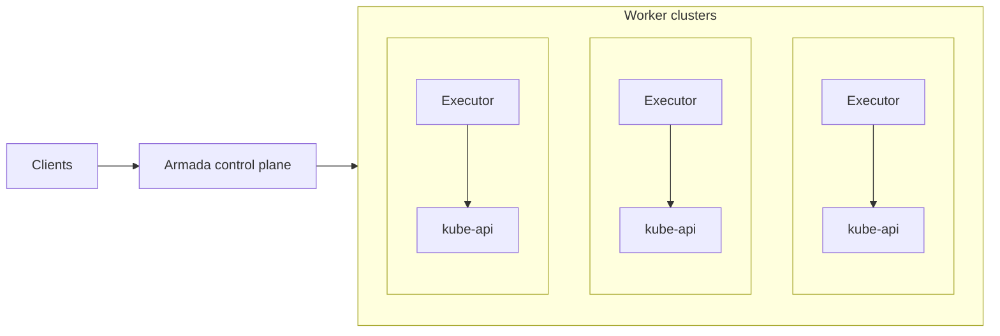

This page explains Armada's system architecture, including its components, event-sourcing design, and how jobs flow through the system.

## System Overview

Armada is a multi-Kubernetes cluster batch job scheduler designed to handle massive-scale workloads. An Armada deployment consists of:

- **Worker clusters**: One or more Kubernetes clusters containing nodes for running jobs
- **Control plane**: Components responsible for job submission and scheduling
- **Executors**: One executor per worker cluster that communicates between the control plane and Kubernetes

The control plane components can run anywhere accessible by executors (same cluster, different cluster, or non-Kubernetes nodes). Each executor typically runs within its worker cluster.

### Deployment Architecture

## Event-Sourcing Architecture

Armada uses an **event-sourcing** (data stream) architecture for high scalability and resilience. The system has two main components:

1. **Log-based message broker**: Stores state transitions durably and in order (the source of truth)
2. **Materialized views**: Independent databases that derive their state from the log

### Key Properties

- **Durability**: Messages are stored durably and survive node failures
- **Ordering**: All subscribers see messages in the same order
- **Eventual consistency**: Databases are updated independently, ensuring eventual consistency
- **Replayability**: Any database can be reconstructed by replaying messages from the log

### Implementation

Armada uses **Apache Pulsar** as the log implementation. This approach provides:

- **Resilience to load bursts**: The log buffers state transitions, isolating downstream components
- **Simplicity and extensibility**: New views can be added by subscribing to the log
- **Consistency guarantees**: Databases eventually converge to the same state

## Control Plane Components

The Armada control plane consists of several subsystems:

### Submit API

- Accepts job submissions from clients
- Handles authentication and authorization
- Validates job specifications
- Publishes job submission events to the log

### Streams API

- Enables clients to subscribe to job state updates via event streams
- Provides a single connection per job set for scalable event delivery
- Isolates clients from internal system messages

### Scheduler

- Maintains a global view of system state
- Makes preemption and scheduling decisions
- Balances fairness, throughput, and timeliness
- Publishes scheduling decisions to the log

The scheduler runs periodically and considers:

- Available resources across all worker clusters
- Queue priorities and fair share
- Job priorities and urgency
- Gang scheduling constraints

### Executors

Each executor is responsible for one Kubernetes worker cluster:

- Queries the scheduler for jobs to run
- Creates Kubernetes resources (pods, services, etc.) via the Kubernetes API
- Monitors job execution
- Reports job completion and resource availability back to the scheduler

### Lookout (Web UI)

- Provides a web interface for viewing job state
- Maintains its own materialized view by reading from the log
- Displays jobs, queues, and system metrics

## Job Lifecycle Flow

Here's how a job flows through the system:

1. **Submission**: Client submits job to Submit API → API validates and publishes to log
2. **Queued**: Scheduler receives job from log and stores it in queue
3. **Scheduled**: Scheduler assigns job to a cluster/node and publishes scheduling decision to log
4. **Leased**: Log processor writes scheduling decision to executor database
5. **Pending**: Executor reads from database, creates Kubernetes resources
6. **Running**: Kubernetes starts containers
7. **Completed**: Executor reports completion → Scheduler publishes completion event to log

## Consistency and Reliability

Armada ensures consistency across components using **ordered idempotent updates**:

- State transitions are published to the log in order
- Each component processes messages independently and idempotently
- Components track the most recent message processed
- After failures, components can recover by replaying from their last checkpoint

This approach provides:

- **Eventual consistency**: All databases eventually reflect the same state
- **Fault tolerance**: Components can recover independently
- **Scalability**: No distributed transactions needed

## Storage and State

Armada uses multiple databases for different purposes:

- **Scheduler database**: Stores jobs to be scheduled (PostgreSQL)
- **Lookout database**: Stores jobs for UI display (PostgreSQL)
- **Executor databases**: Interface between scheduler and executors

All databases are materialized views derived from the log, ensuring they can be reconstructed if needed.
